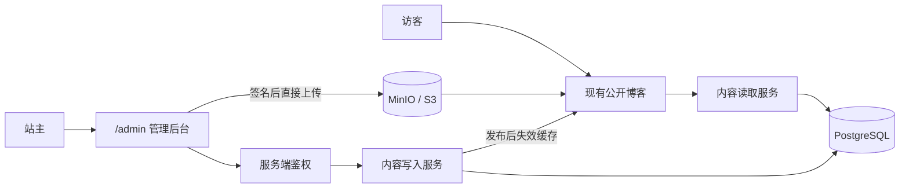

# Nerukigat 博客管理后台改造方案

> 状态：MVP 已实施，等待接入真实 PostgreSQL / R2 并执行迁移验收
> 日期：2026-07-14
> 工作分支：`codex/blog-admin`

## 1. 结论与约束

本次改造采用“单仓库、单 Next.js 应用、模块化单体”的方式，在现有博客中增加管理后台，不改成 monorepo，也不引入独立 CMS 后端。

核心结论如下：

1. 公开博客的页面结构、视觉样式、文章排版和原有 URL 原则上保持不变。
2. 文章仍使用 Markdown/GFM 编写和渲染，不切换到 Lexical 等富文本专有格式。
3. 改造重点是把内容来源从构建期 MDX 文件切换为 PostgreSQL，并新增登录、草稿、预览、发布和媒体管理能力。
4. 公开页面仍可使用静态生成或缓存；管理后台和写入操作为动态服务端能力。
5. 本地开发使用 PostgreSQL 和 MinIO，正式环境使用托管 PostgreSQL 和 S3 兼容对象存储。
6. 第一版不引入 Redis、WebSocket、微服务、多用户权限和公开图库。

因此，“样式不改”不等于前台代码完全不动。前台需要替换数据读取和正文编译方式，但应保持现有组件、DOM 结构、Tailwind `prose` 样式及用户可见行为。

## 2. 改造目标

### 2.1 必须实现

- 站主可以通过浏览器登录后台。
- 可以在电脑、平板和手机上创建、编辑和发布文章。
- 支持草稿、自动保存、预览、发布和撤回。
- 修改已发布文章时，线上版本在再次发布前不受影响。
- 可以拖拽、粘贴或从媒体库选择图片插入文章。
- 发布后自动刷新文章页、列表页、归档、Weekly、RSS 和 Sitemap。
- 现有文章 URL、文章展示样式和 SEO 信息保持兼容。
- 内容与图片可导出、备份和恢复。

### 2.2 明确不做

- 不直接接入或 fork `mx-space/core`。
- 不将项目拆成 `apps/*`、`packages/*` 的 monorepo。
- 不重做公开博客 UI。
- 不将所有公开页面改为每次请求都动态渲染。
- 不在第一版实现多用户、多角色和开放注册。
- 不在第一版实现评论系统、AI 写作、实时协作、公开相册或全文搜索。

### 2.3 当前实施状态

本分支已经完成：

- PostgreSQL/Drizzle Schema、迁移和本地 Compose。
- Better Auth 单站主登录、后台保护和初始化脚本。
- 文章列表、新建、手动保存、草稿预览、发布/重新发布和归档。
- Contentlayer/数据库双内容源，公开页面默认仍使用静态源。
- 61 篇 MDX 的只读审计和双重确认事务导入脚本。
- 安全 Markdown/GFM 渲染，复用原有标题、目录、图片和 `prose` 样式。
- R2/MinIO 直传、服务端图片解码/去元数据/重新编码、媒体库和稳定 `/media/:id` 地址。

正式切换前仍需：

- 填写真实数据库与 R2 Secret，实际执行迁移、站主初始化、内容导入和 R2 smoke test。
- 完成自动保存；当前为带乐观锁的显式保存。
- 将媒体选择/粘贴更深地集成进编辑器；当前通过媒体库复制 Markdown。
- 增加 Markdown 导出、数据库备份恢复、stale pending 清理和部署层限流。
- 按需迁移旧 `/postImg/**`；当前继续兼容仓库内历史图片。

## 3. 当前基线

当前内容由 [`contentlayer.config.ts`](../contentlayer.config.ts) 在构建阶段读取 `posts/**/*.mdx`：

- 内容格式为 MDX，并启用了 GFM。
- 字段包含 `title`、`date`、`slug`、`tags`、`description`、`draft` 和 `top`。
- 实际文章地址来自文件的 `_raw.flattenedPath`，而不是 Frontmatter 的 `slug`。
- 详情页通过 `post.body.code` 和 [`components/MDXContent.tsx`](../components/MDXContent.tsx) 渲染正文。
- 文章列表、Weekly、Feed 和详情页都直接依赖 Contentlayer 的 `allPosts`。

截至本方案编写时：

- 共有 61 篇 MDX 内容，其中 16 篇 Weekly、1 篇草稿。
- `public/postImg` 中有 153 个实际图片文件，总体积约 374 MB。
- 共有 152 个图片地址被文章引用，没有失效引用；另有 1 个未引用图片。
- 部分原图尺寸和体积较大，单张接近 15 MB，不适合经过普通服务端表单中转上传。

这些数字用于迁移验收，不作为永久业务限制。

## 4. 保持不变的公开博客

以下内容属于兼容边界，改造时不得随意改变：

| 项目 | 约束 |
| --- | --- |
| 路由 | 现有 `/posts/**`、`/weekly`、归档和 Feed 地址保持不变 |
| Canonical URL | 迁移后必须与当前 `_raw.flattenedPath` 一致 |
| 页面组件 | 优先复用现有 Header、容器、文章标题、目录、图片预览等组件 |
| 排版 | 保留现有 Tailwind `prose`、暗色模式、代码块和表格样式 |
| Markdown | 保留 GFM、代码块、链接、表格和现有安全 HTML 的展示能力 |
| 图片 | 迁移期间 `/postImg/**` 继续可访问，不要求一次性搬迁 |
| SEO | 保留标题、摘要、发布日期、标签和现有页面语义 |

前台主要发生以下内部变化：

1. 把 `allPosts` 替换为服务端内容仓储查询。
2. 列表页只向客户端传递公开摘要，不再把全部正文和草稿打入浏览器 Bundle。
3. 把 Contentlayer 编译后的 `body.code` 替换为数据库 Markdown 的安全渲染结果。
4. Feed、Weekly、归档、详情页和 Metadata 统一使用同一内容服务。
5. 图片组件增加媒体资源解析能力，同时继续兼容 `/postImg/**`。

## 5. 目标架构



公开站点与管理后台位于同一个 Next.js 应用：

- 一个仓库。
- 一个 `package.json`。
- 一套构建和部署流程。
- 后台重型组件仅在 `/admin` 路由加载。
- 数据库和对象存储模块只能被服务端代码引用。

建议增加以下逻辑目录，不强制整体迁移到 `src/`：

```text
app/
  admin/                 # 登录、文章管理、媒体库
  api/                   # 必要的上传、预览等 HTTP 接口
lib/
  auth/                  # Session 与权限校验
  db/                    # 数据库连接
  posts/                 # 文章查询、草稿、发布业务
  media/                 # 上传、对象存储与图片引用
  markdown/              # Markdown 解析、过滤和渲染
db/
  schema/                # Drizzle Schema
  migrations/            # 数据库迁移
scripts/
  import-mdx.ts           # 现有内容导入
  export-markdown.ts      # 内容导出
  create-owner.ts         # 初始化站主
```

## 6. 内容模型

### 6.1 文章

`posts` 保存文章身份、固定路径和当前发布状态，至少包含：

- `id`
- `kind`：`post` 或 `weekly`
- `canonical_path`：唯一且默认不可变
- `status`：`draft`、`published`、`archived`
- 当前已发布内容或已发布版本引用
- `published_on`：无时区的日历日期
- `published_at`
- `is_pinned`
- `created_at`、`updated_at`

### 6.2 草稿与版本

`post_drafts` 保存后台正在编辑的工作副本：

- 标题、摘要、正文 Markdown、标签和日期。
- `version` 字段用于乐观锁，避免多个页面互相覆盖。
- 已发布文章的草稿不会被公开查询读取。

`post_revisions` 保存发布快照，用于审计和后续回滚。第一版只要求每次发布生成快照，完整的版本浏览 UI 可后置。

### 6.3 标签与重定向

- `tags`、`post_tags` 用于标签筛选和统计。
- 后续可增加 `post_redirects`；如果确实修改 `canonical_path`，旧地址必须重定向到新地址。

## 7. Markdown 策略

数据库保存原始 Markdown 文本，而不是保存编译后的 JavaScript 或 Lexical JSON。

支持范围：

- CommonMark/GFM。
- 标题、列表、引用、代码块、表格、链接和图片。
- 当前内容确实需要的有限 HTML。
- 现有标题和图片组件映射，以保持目录、样式和图片预览体验。

安全约束：

- 不允许文章正文执行任意 JavaScript。
- 不允许从正文任意 `import` React 组件。
- HTML 使用白名单过滤。
- 外链、图片协议和嵌入内容必须校验。

导入脚本需要扫描现有 MDX；如果发现无法直接表示为 Markdown 的 JSX/组件，必须生成报告并单独迁移，不能静默丢失。

## 8. 管理后台

### 8.1 路由

```text
/admin/login
/admin/posts
/admin/posts/new
/admin/posts/:id/edit
/admin/media
/admin/settings
```

### 8.2 第一版功能

- 单站主登录，关闭公开注册。
- 文章列表及草稿/已发布/已撤回过滤。
- Markdown 编辑与分栏预览。
- 标题、摘要、发布日期、标签、置顶和固定路径编辑。
- 自动保存与保存状态提示。
- 发布、重新发布、撤回和删除。
- 图片拖拽、粘贴、上传和媒体库选择。
- 响应式布局，保证手机上可以完成编辑与发布。

所有写操作都必须在服务端再次校验 Session 和输入，不能依赖前端隐藏按钮作为权限边界。

### 8.3 预览与发布

- 预览页必须鉴权并设置 `noindex`、`no-store`。
- 发布操作在数据库事务中更新发布版本、标签和媒体引用。
- 发布成功后刷新文章页、文章列表、Weekly、归档、RSS 和 Sitemap 缓存。
- 因为后台与公开博客在同一应用中，第一版不需要 mx-space 式的 Webhook。

## 9. 媒体库与对象存储

### 9.1 存储策略

- 本地：MinIO。
- 正式环境：Cloudflare R2、阿里 OSS 或腾讯 COS 等 S3 兼容服务。
- 应用通过统一存储接口访问，不在业务代码中绑定供应商。
- 数据库保存 `asset_id` 和 `storage_key`，不把 `localhost` 或供应商 Endpoint 固化到正文。

正文使用环境无关的稳定引用，例如：

```md

```

渲染时再将资源解析到当前环境的实际图片地址。

### 9.2 媒体元数据

`media_assets` 至少保存：

- `id`、`storage_key`、原始文件名。
- MIME、文件大小、宽度、高度、SHA-256。
- `alt`、`caption`、主色或低清占位信息。
- `status`：`pending`、`active`、`detached`、`deleted`。
- `legacy_path`、创建时间和删除时间。

`post_media` 记录文章与图片的引用关系，避免删除仍被其他文章使用的文件。

### 9.3 上传流程

1. 后台向服务端申请短期上传凭证。
2. 浏览器直接上传到对象存储，避免大图经过 Next.js 请求体中转。
3. 服务端确认对象存在并校验真实类型、大小、像素和哈希。
4. 去除公开版本中的 GPS 和设备序列号等敏感 EXIF。
5. 生成缩略图和适合网页展示的版本。
6. 写入媒体记录并插入文章。
7. 发布时标记引用为 `active`；移除后进入 `detached`，延迟清理。

### 9.4 媒体库与公开图库

媒体库是后台写作工具，第一版需要实现；公开相册是面向访客的新产品功能，暂不包含在本次 MVP 中。未来如需要公开相册，再增加 `albums` 和 `album_photos`，复用同一批媒体资源。

## 10. 本地开发与正式环境

本地通过 `compose.yaml` 启动：

- PostgreSQL。
- MinIO。
- 持久化 Volume。

Next.js 仍使用现有开发命令启动。环境变量至少包括：

- `DATABASE_URL`
- `BETTER_AUTH_SECRET`
- `BETTER_AUTH_URL`
- `ADMIN_EMAIL`
- `AUTH_TRUSTED_ORIGINS`
- `S3_ENDPOINT`
- `S3_REGION`
- `S3_ACCESS_KEY_ID`
- `S3_SECRET_ACCESS_KEY`
- `S3_PUBLIC_BUCKET`
- `S3_PRIVATE_BUCKET`
- `S3_PUBLIC_BASE_URL`

`.env.example` 只提交变量名和安全示例，不提交真实密码或云端密钥。

正式部署时替换数据库连接和 S3 配置即可，业务表、对象 Key 和正文引用不变。若当前部署平台只支持纯静态文件，则必须迁移到支持 Next.js 服务端运行能力的平台。

## 11. 迁移与切换

### 阶段 A：基础设施（代码已完成）

- 添加 PostgreSQL、MinIO、本地环境配置和数据库迁移。
- 初始化站主账号。
- 建立认证与 `/admin` 保护布局。
- 现有公开博客仍读取 Contentlayer。

### 阶段 B：后台内容管理（MVP 已完成）

- 已实现文章列表、编辑、显式保存、预览、发布和撤回；自动保存待补。
- 实现统一内容查询/写入服务。
- 后台写入数据库，但暂不切换公开页面。

### 阶段 C：内容导入和公开读取切换（代码已完成，数据未写入）

- 导入脚本先执行 dry-run，输出数量、URL、字段和不兼容内容报告。
- 导入全部现有文章，保持 `_raw.flattenedPath` 对应的 URL。
- 校验 61 篇内容、Weekly、草稿、日期、标签、置顶和摘要。
- 引入临时配置 `CONTENT_SOURCE=contentlayer|database`。
- 将详情、列表、Weekly、归档和 Feed 切换到内容仓储。
- 验证完成前不删除 `posts/**/*.mdx`。

### 阶段 D：媒体库（新图片链路已完成）

- 新图片先走 MinIO/S3 链路。
- 旧 `/postImg/**` 继续读取。
- 后续按引用清单迁移现有图片，逐个校验哈希和页面展示。
- 所有页面验证通过后，再决定是否清理 Git 中的原图。

### 阶段 E：上线与保障（待真实环境执行）

- 切换到正式 PostgreSQL 和对象存储。
- 增加数据库备份、Markdown 导出和恢复说明。
- 执行权限、上传安全、构建和端到端测试。
- 移除临时切换逻辑和不再使用的 Contentlayer 依赖。

## 12. 回滚策略

在迁移验收完成前：

- 原始 MDX 文件保持不变。
- 原始 `/postImg/**` 文件保持不变。
- 通过 `CONTENT_SOURCE` 可以恢复使用 Contentlayer。
- 数据导入脚本必须可重复执行或明确拒绝重复数据。
- 不做 MDX 与数据库双向写入，避免两个事实来源长期分叉。

切换完成后，数据库成为唯一写入源；仓库保留定期 Markdown 导出，确保内容不被数据库或特定 CMS 锁定。

## 13. 验收标准

- 现有公开页面没有计划外的视觉变化。
- 现有文章和 Weekly URL 全部可访问，无重复或遗漏。
- Markdown 标题、目录、代码块、表格、图片预览和暗色模式与当前一致。
- 未登录用户无法查询草稿正文、草稿元数据和管理接口。
- 编辑已发布文章不会立即影响线上内容。
- 可以在手机浏览器完成登录、编辑、上传图片和发布。
- 发布后对应页面和 Feed 能及时展示新版本。
- 对象存储切换不需要批量重写文章正文。
- 数据库和图片均有经过验证的备份与恢复路径。

## 14. 后置能力

以下能力只有出现明确需求后再实施：

- 公开摄影相册。
- 完整版本对比 UI。
- 多用户和角色权限。
- Redis 缓存或任务队列。
- 独立图片处理 Worker。
- WebSocket 实时更新。
- 全文搜索。
- 评论系统。
- AI 写作与自动摘要。
- monorepo 或独立后台部署。
