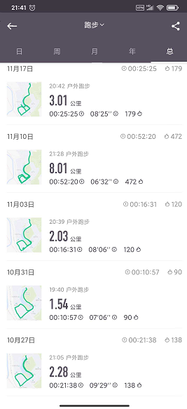
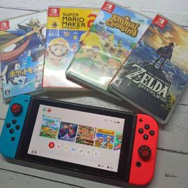

博客不知不觉就写一年了。
试着对自己过去一年进行一个复盘，就像瑞·达利欧所说的：

> **生活中的大多数东西都不过是「同类情况的重演」。**

得学着从过去中汲取经验。

## 2020

### 健康

- 无论啥时候健康总是首位，1月中旬的时候终于把横在身体里三年的两根钢板拆掉了，熬过来了后想想好像也没什么，虽然当时好像痛的很厉害😅
- 疫情返校后有在学校里断断续续地跑步，最长的一次不停地跑了八公里🏃
- 后面也有买瑜伽垫来做俯卧撑+仰卧起坐+深蹲。

可惜以上的项目随着考试月的到来以及天气降温全部停掉了🐷

### Code

- 继续学习着Vue和小程序，稍微看了一点点的node.js，但是都不算精。
- 前不久买了本JavaScript高级程序设计看，希望能在这个假期里面啃完。
- 也在试着用自己新学到的东西去敲点小东西出来，除了学到东西外更多的是给我带来了一些成就感。

学习就是要静下心来，好好沉淀（然而还是很菜）。🎯

### 设备

- 入了个茶轴的Anne pro2，60%布局+蓝牙真的让我体验到了无线的便利以及轻巧。
- 当全世界在讨论2077的时候我才购入了动物森友会，跟着她一块岛建中。
- 买了零件亲自给5s更换电池以及排线，梦回高中。

### 日常

**日常就是折腾。**

疫情在家想给电脑加多根内存条，心血来潮想换换硅脂，结果拧螺丝拧上头导致风扇的一颗螺丝拧花了取不下来。
祸不单行，电脑的电源也坏了……遂又买了电源自己换。

前不久考试那段时间电脑开机以及读取机械硬盘里的数据非常慢，甚至直接卡死……重装系统等各种操作才排查出来是我的机械硬盘坏了，遂拆掉去网上买了个固态，又是突然的心血来潮给自己电脑装了个Ubuntu，但是用不惯，一天后就换回来了。

这台电脑从windows->macos->windows->ubuntu->windows，真的是玩了个遍。

## 2021

### 出行

疫情期间+封校让这一年的出行基本都泡汤了，希望明年能多出去走走，见识见识。
对于不怎么学校的我，先不说出省了，能把广州好玩的地方逛完就不错了。🤔

- [ ] 逛遍广州

### 能力

- [ ] 学习React
- [ ] 啃掉JavaScript高级程序设计、深入浅出node.js等书籍
- [ ] 做些新东西，为开源做贡献

### 健康

- [ ] 养成锻炼的习惯
- [ ] 给我早睡！

### 生活

- [ ] 培养一门新的特长

## 最后

2020虽然充满遗憾，但还是要充满对生活的热情。人间值得，未来可期。
遗憾会是惊喜的序曲。

