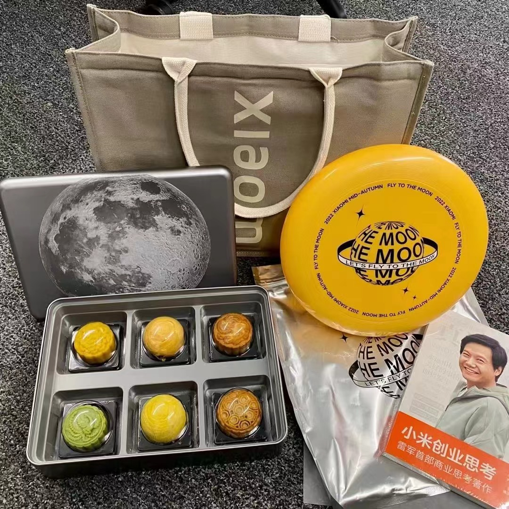
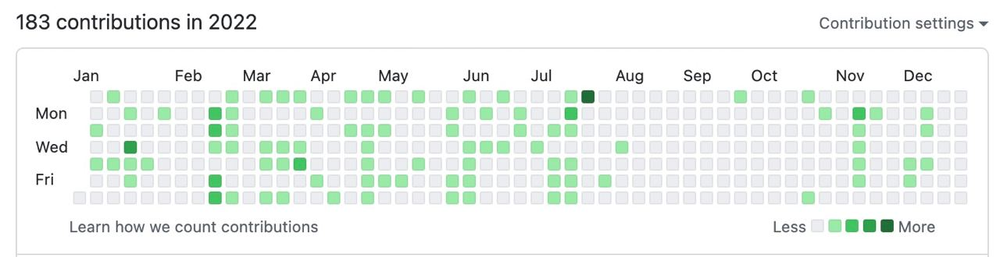
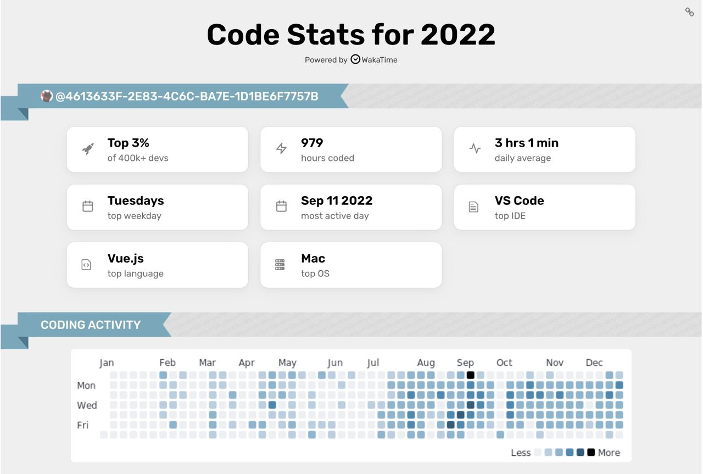
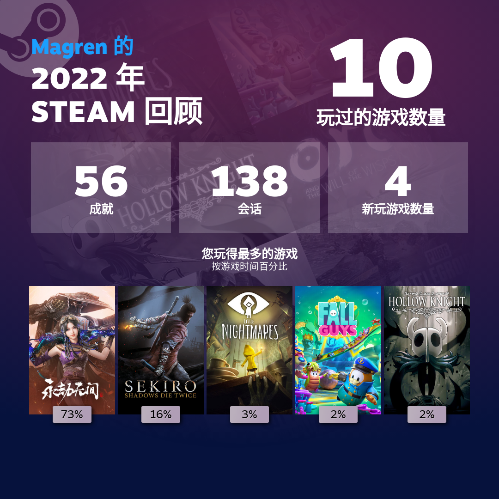
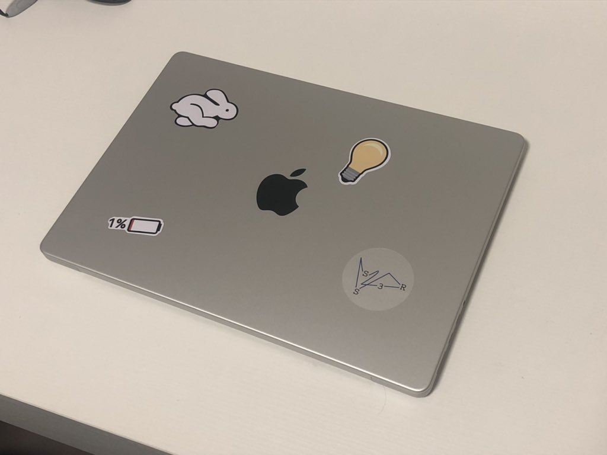
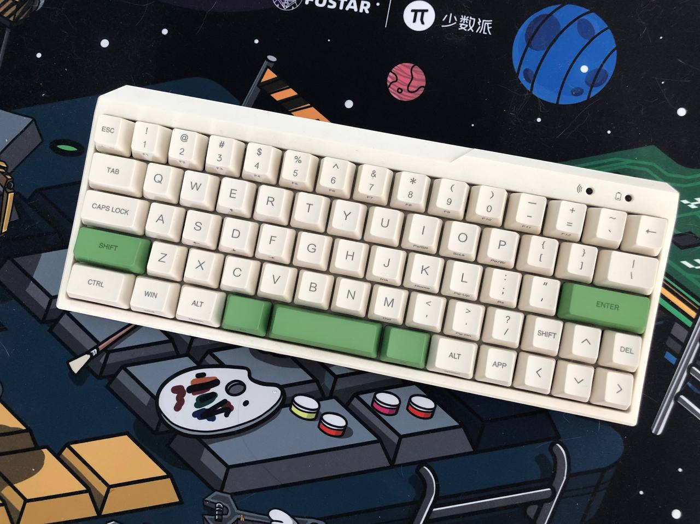
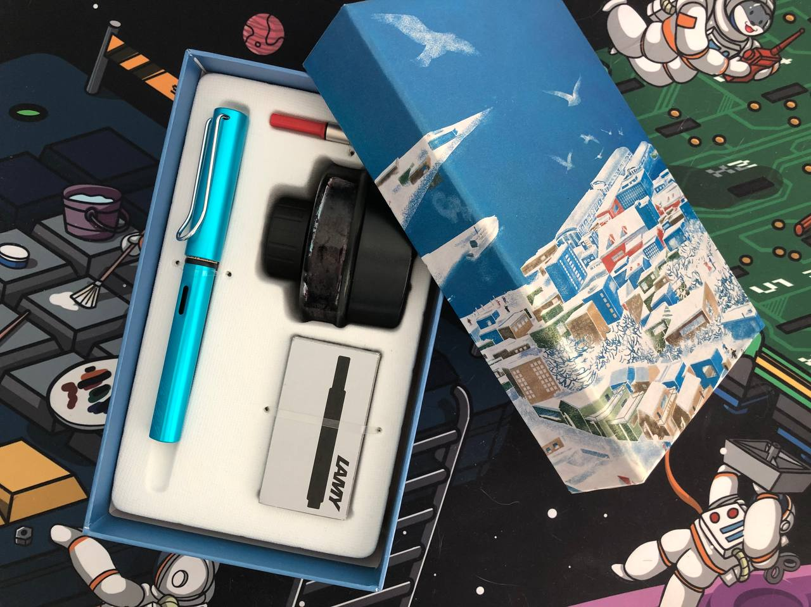
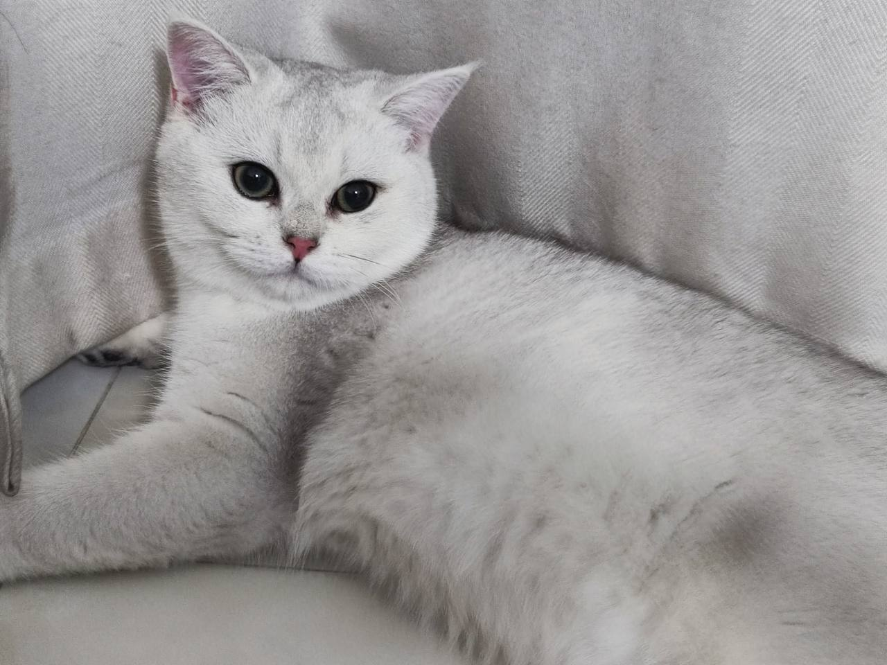
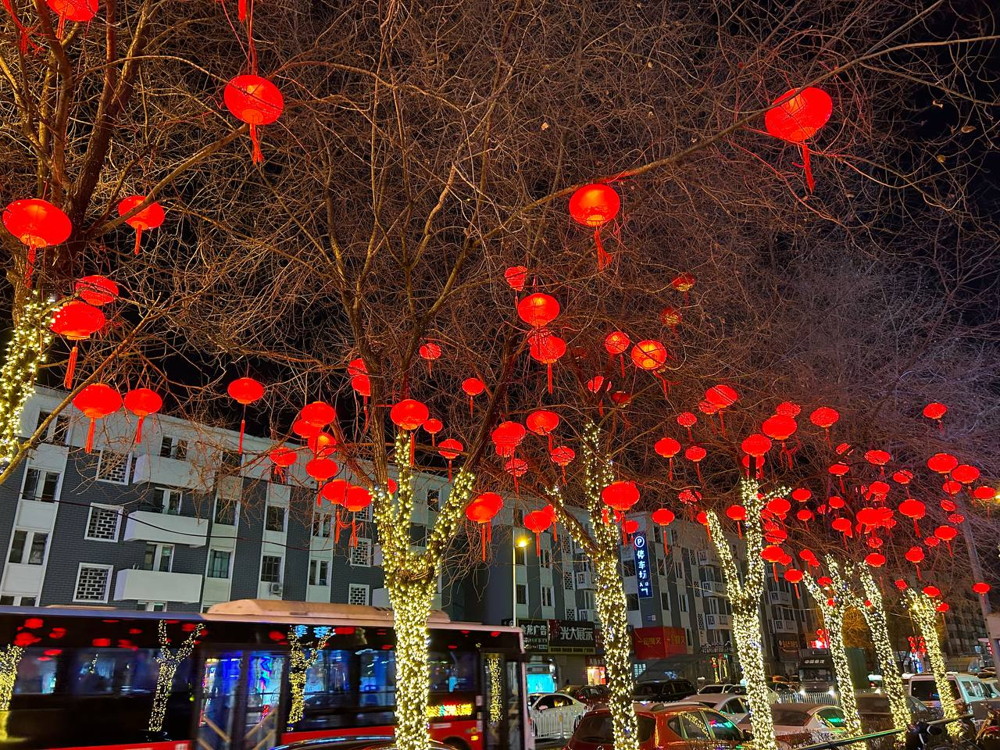

> 2021的总结：[2021,否极泰来](/posts/2021-summary/)

> 2020的总结：[2020，遗憾是惊喜的序曲](/posts/2020-summary/)

岁月不居，时节如流。2022一下就到了尾声，照例在最后两天才匆匆开始写自己的年终总结（拖延症晚期），姑且笔随心走，在这里安置自己这一年的时光。

<!--more-->

## 回顾去年的Flag

- [x] 好好睡觉
- [ ] 捡回夜跑的习惯，好好锻炼
- [x] 保持一个好的心态
- [x] 要踏入社会啦，好好工作
- [ ] 继续在前端摸爬打滚，深入学习
- [x] 继续做新东西，继续折腾
- [ ] LeetCode！
- [x] 把自己的毕业设计做好
- [ ] 学会理财
- [ ] 如果疫情好转的情况下，继续逛完广州
- [x] 看5 ~ 10本书

这一年里踏入社会正式开始工作，每天早上8点半爬起来并且在公司输出自己，生活变得规律了许多，现在每到12点就开始昏昏欲睡💤

同样是因为工作，每天基本都是九点后回家，所以导致也没机会夜跑，另一个方面是北京10月份开始的妖风实在太大了，把我人都吹傻了 ~~当然本质还是自己懒，诶嘿~~

前端学习方面，虽然在公司里接触到了一些新的技术，学习到了一些新的东西，但是感觉自己不够深入，在这个方面感觉只能给自己打一个及格分，并不能算完成了，还得稳下心来好好沉淀自己🧐

理财……不提也罢😭

在今年上半年疫情一直不算是好转的状态，自己更多的时间是在学校跟朋友一块干完毕设以及玩游戏，7月就跑来了北京，很可惜没有逛完广州，不过现在政策彻底放开了，就争取逛完北京吧🗺️

## 我的2022

### 生活、工作

我想我一直不是个念旧的人，但是在跟学校的小伙伴吃完最后一顿饭散场的时候我还是忍不住落下泪来，至此我们几个人基本都天各一方，什么时候还能凑齐这一批人都说不定。回想自己大学四年，有优秀的师兄在我编程的启蒙上给予了莫大的帮助，给我寻找工作实习提供了一些宝贵的建议；有玩的到一块的舍友和朋友陪伴以及带来许多快乐，并且在我压力大的时候给我支持。
希望将来有机会我们还能聚在一块把酒言欢，就祝愿大家万事顺意吧🍻。

从七月开始就跑到了北京，开始了北漂。如果说刚来北京有什么最不习惯的话……那就是在我司食堂吃什么都感觉是辣的……然而同事都说这个不辣啊😓

北漂打工的生活没有自己想象中那么好，但是也没有自己想象中这么差。

目前工作时间基本都是 10 9 5，周末基本都不会加班。在大学放松太久的自己一开始对这个上下班时间有点难熬，甚至感觉自己每天的时间都排的很紧，都在干活😩。不过熟悉项目后对需求就利索了，对这种工作时间也渐渐习惯，有时候晚上还可以抽出时间来逛逛Github，学习点东西。在组里同事氛围也很好，遇到不会的问题问问同事，只要手里没有紧急的活基本都会有回应；大家每天也是抱团一块去吃饭，吃饱饭一块在园区散步溜达聊天；生活上遇到一些问题也会能帮就帮，很庆幸自己能遇到这么棒的Ld以及同事。 前两天也进行了转正答辩，希望一切都能顺利。

七月份到小米，夏季的衣服基本都是小米给的……我记得光是文化衫我就已经领了四件不重样的了，还有小米的背包跟雷总的书。中秋节也领到了小米给的月饼礼盒。印象中1024程序员节的时候也有活动领东西，可惜当时自己并没有参加🤧

有点遗憾的是，今年虽然来了北京，但是北京很多地方（故宫、天安门等）都还没去过，周末都宅在家或者去星巴克写代码了，争取明年都能够逛逛🚶‍♂️

### 健康

这一年里没怎么锻炼，感觉自己的身体素质没有什么提高，在12月中旬的时候很不幸感染了新冠，躺在床上烧了两天😷（感谢女朋友在这两天无微不至的照顾），最高烧到39.9（鬼知道夜里有没有上去），在前几天咳嗽也终于好了，实在是太折腾人了，希望没有感染的朋友都能一直没事，感染的朋友都早日康复转阴。据网传消息，南北方的毒株还不一样，我怕不是过年回家的时候再来一遍😵‍💫

#### Code , Learning

- 从七月份开始打工，大部分时间聚焦在工作的业务上，就少折腾了一些，自己在开源上也没有什么贡献，但是在这一年里提了程序员生涯中的第一个PR，希望后续能够提许许多多的PR，能够为开源做更多的贡献🙁
- 这一年里稍稍接触了Three.js、Nuxt、Next.js，但是都还没有输出什么，争取明年拿自己所学的东西折腾点新玩具
- 在公司里学到了一些除开发之外的知识（充分利用所在平台的资源，无论是不是自己方向的，能多学点总不是坏事🎫
- 今年写代码的时间都集中在下半年（因为上半年都跟舍友鬼混打游戏去了），不知不觉肝了快1000h👾

### 书、影视

##### 书

这一年看的书比较少，大致是因为下半年把自己的大部分时间都投入到工作中，希望能够跟上周围同事脚步的原因吧。
希望后面看书都可以写写书评或者读后感，既有输入也有输出，才是最好的学习办法。

- Vue.js的设计与实现
- 小米创业思考
- 我是猫
- 钝感力
- 窄门
- 硅谷钢铁侠：埃隆·马斯克的冒险人生（Reading

##### 影视

电影看的比起去年就少的更多了……不过倒是补了两部很经典的电影《星际穿越》和《蝴蝶效应》。

- 误杀2
- 这个杀手不太冷静
- 独行月球
- 星际穿越
- 沼泽里的女孩
- 蝴蝶效应

### 游戏

今年上半年都在跟舍友永劫无间里边震刀，但可惜毕业跑来北京后就没怎么玩了，然后在正式上班前把2019年的年度游戏《只狼·影逝二度》给通关了，一周目足足打了42h，在佛雕师那不知道跪了几次的我最后选择了逃课😵，有时间二周目的时候一定好好面对。

Switch 今年买了好几款游戏，马里奥赛车8、怪物猎人崛起、宝可梦阿尔宙斯以及紫，这几款都是我觉得非常优秀的游戏（宝可梦有信仰加持），宝可梦紫目前还没有通关，感觉比剑盾还好玩，就是bug以及画质有点拉胯，希望GF能够好好提升技术力，不要糟蹋了Pokemon这个IP了😟

### 买了啥？

你大清自有国情在，我自有我要花的钱💰

##### 主力生产工具MacBook pro 2021 14寸

用久了厚重的游戏本，突然换到macbook pro至少是让我负重减轻了，日常开发性能也完全足够，甚至风扇都不带响一下，唯二的不好可能就是键盘容易打油以及冬天冻手（它不发烫啊🥵

##### Filco Minila Air

这把键盘是我某鱼二手掏来的，换了一套PBT的键帽换上。虽然它已经是几年前的键盘了，但是60+的键位以及独特的配列，蓝牙的连接速度，让我十分中意，目前已经是主力键盘，不好的也是因为它是几年前的键盘，可能用的蓝牙版本比较老，目前偶有断连的情况。

##### Lamy 恒星（太平洋蓝）

这只钢笔的太平洋蓝配色是17年的限定色，那时候的我还在读高中，有着写日记的习惯，也很喜欢这个钢笔的配色，但是当时并没有条件买下它，并且我写日记的习惯到了大学就中断了。最近决定重新开始写日记，就把当年的遗憾补上了，现在用着它在重新写日记🖋️。

##### Crystal

一只每天不是吃就是睡的猫，目前天天调皮捣蛋跑酷跟我抢吃的，很怀念它刚来的时候唯唯诺诺躲在沙发底下的模样。

### 2022，脑子里的胡思乱想

在互联网寒冬的2022下，京东、有赞在春季的时候就大面积的裁员跟毁三方，当时我司印象中在4月份裁了一波员，当时一些公司直接越过了22届的最后一次校招，直奔23届的实习招聘，有的公司甚至直接不招，然后我司在12月也进行了一波，说实话心态没有受到影响是骗人的，常常思考自己做的是否足够，自己是否还有什么不足，但是久而久之发现这可能并不是我努力就可以改变的事情，这种事其背后的原因都是复杂的，甚至有一些不可抗的因素。

那么在这寒冬之下我又能做到什么呢？在所有因素里边，聚焦自己能控制的因素，老老实实地提升自我，多关注自己的成长本身，保证自己的心态。

> 如果你对一个事情过度的担心，那你只是在创建一个你不想看见的事实，而强迫你自己在这个事实中存在。

## 2023

### Learning

- [ ] 学习到的知识要进行输出
- [ ] 每周一个ARTS（Algorithm: 每周至少做一个 LeetCode 的算法题；Review: 阅读并点评至少一篇英文技术文章；Tips: 学习至少一个技术技巧；Share: 分享一篇有观点和思考的技术文章）
- [ ] 继续做好自己的工作，争取有新的突破
- [ ] 在开源上做出一些微不足道的贡献
- [ ] 更加深入探索Web3

### 生活

- [ ] 去外边有意思的地方逛逛，少宅在家里
- [ ] 依然是看5～10本书（可以的话书评、读后感写上
- [ ] 每个月抽固定的金额作为理财

## 最后

> 凡是过往，皆为序章。

希望新年一年里一切糟糕的事情都会过去，一切都会慢慢好起来。
以期待的心情拥抱2023。

_谨以此文献给自己_

