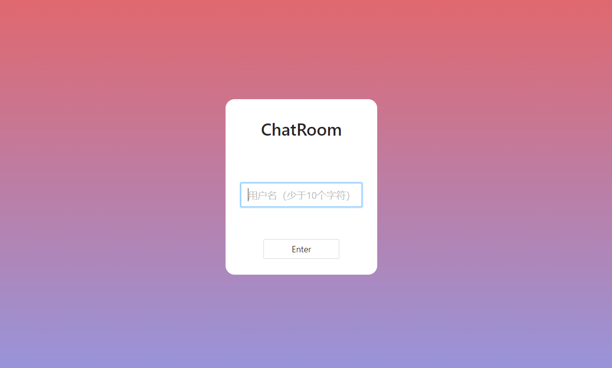
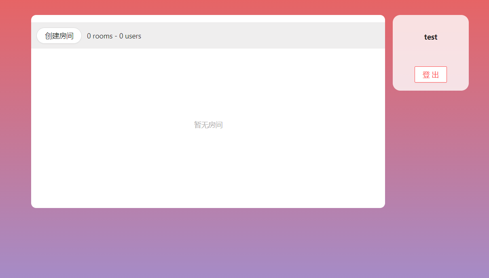

## 学习新东西👋

最近这几天在学习React，所以这个项目主要目的是给我熟悉React，我个人是喜欢边学习一样新东西边动手，只有输出才会让我记忆更深刻，其次也会踩到一些光看是不会碰到的坑，加上之前学习node.js好像也没有做什么，于是就想到了结合在一块做一个聊天室。✌

<!--more-->

因为是第一次做React，如果觉得有什么需要修改的欢迎提出[Issuse](https://github.com/Magren0321/ChatRoom/issues)，也欢迎你的star⭐

项目地址：[ChatRoom](https://github.com/Magren0321/ChatRoom)

项目截图：




## 后端

后端基于Node.js + Express + Socket.io + MongoDB
Node.js操作MongoDB以及用express写接口之前都有在博客中大致的总结过：
[Node.js+express](./node-express/)
[Node.Js操作MongoDB](./node-mongodb/)
这次用的新东西就是Socket.io。

### 前人的工作👇

> Socket.IO is a library that enables real-time, bidirectional and event-based communication between the browser and the server

即是说Socket.io可以实现服务器与客户端之间的一个实时的双向通信。
在连接Socket.io的之前还得先知道**WebSocket**，在WebSocket问世之前，在创建拥有双向通信机制的 web 应用程序时，就只能利用 HTTP 轮询的方式，由此产生了 “短轮询” 和 “长轮询”。

> 短轮询通过客户端定期轮询来询问服务端是否有新的信息产生，缺点也是显而易见，轮询间隔大了则信息不够实时，轮询间隔过小又会消耗过多的流量，增加服务器的负担。
> 长轮询是对短轮询的优化，需要服务端做相应的修改来支持。但是每次请求还是都要带上HTTP请求头部，而且在长轮询的连接结束之后，服务器端积累的新消息要等到下次客户端连接时才能传递。

Websocket协议就是为了解决长轮询的痛点而诞生的，其基于TCP协议，是一种双全工通信技术、复用HTTP握手通道。它与HTTP协议的唯一关系就是它的握手请求可以作为一个**Upgrade request**经由HTTP服务器解析，且与HTTP使用一样的端口。

接着是**Socket.io**，Socket.io底层基于**engine.io**，封装了WebSocket，其屏蔽了底层细节，让顶层调用非常简单。同时它还支持许多种轮询机制以及其他通信方式，当环境不支持WebSocket的时候它能自动选择最佳的方式来实现网络的实时通信。

### 使用

引入io设置端口后监听connect事件：

```js
const server = require('http').Server(app);
const io = require('socket.io')(server);

server.listen(3001); //端口设置3001

io.on(('connection', socket=>{

    ………………

})
```

接着通过最重要的两个api，**emit**和**on**来发送以及监听事件

- socket.emit(eventName,[ ...args])：发射（触发）一个事件
- socket.on(eventName, callback)：监听一个 emit 发射的事件

```js
//监听xxx事件，输出传进来的data对象
socket.on("xxx", (data) => {
	console.log(data);
});
//发送xxx事件，传出去一个对象，里面有name属性
socket.emit("xxx", { name: "magren" });
```

另外用到的方法

- socket.join(id)：加入到一个room为id的房间中
- socket.broadcast.to(id).emit( )：广播给room为id的除了‘我’以外的所有人
- io.sockets.in(id).emit( )：广播给room为id的所有人

## 前端

前端基于React + Redux + Typescript + Antd

向后台发送消息以及监听很简单，只需要引入**socket.io-client**，接着使用emit发送和on监听事件即可。

```js
const socket = require('socket.io-client')('ws://localhost:3001',{transports: ['websocket']})

//监听信息
socket.on('chat_message',(data: mesItem)=>{
  this.setState({
    message:[data,...this.state.message]
  });
})
//发送加入群组
socket.emit('join', {
  roomId:this.props.match.params.roomId,
  userName:this.props.state.name,
  userId:this.props.state.id
})
//发送信息
socket.emit('mes',{
  roomId:this.props.match.params.roomId,
  userName:this.props.state.name,
  userId:this.props.state.id,
  mes:this.state.msg
})
```

### 关于Redux

redux跟vuex的理念给我的感觉是一样的，同样都是一个状态管理库，并且都是保存在内存当中（刷新就会重置），定义全局state，触发后修改state。不同的地方也还是有的，Vuex的数据是可变可直接修改，Redux不可变并且是直接用新的state替换掉旧的state。

这个项目用了 **[react-redux](https://github.com/reduxjs/react-redux)** 和 **[redux-thunk](https://github.com/reduxjs/redux-thunk)** 两个库。

使用了react-redux后流程大大缩短，store的三大功能：dispatch，subscribe，getState都让它来帮我们实现了，同时它提供了Provider和Connect，前者是一个组件，后者是一个函数。
大致的流程就是Provider组件接受redux的store作为props，然后通过context往下传，connect函数收到Provider传出的store，并将state和actionCreator以props传入组件，组件就可以通过调用props里的action触发reducer函数返回新的state，connect监听到变化后调用setState更新组件并将新的state传入。

**redux-thunk**的作用：可以让 store.dispatch 变成可以接收一个函数/一个对象的中间件。

> 让原本只能接受对象的 store.dispatch 变成可以接收对象/方法，并且如果接收了一个方法后自动执行该方法，而不触发 redux 的 store 更新。

## 最后💻

感谢Google、baidu等搜索引擎和Google翻译😵
以及[bailicangdu](https://github.com/bailicangdu)大佬的[react-pxq](https://github.com/bailicangdu/react-pxq)项目的参考以及总结😘
