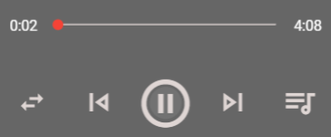

# 前言
这个项目是我某天在宿舍听歌想到的，从16年注册网易云到现在都有五年的时间了，虽然这个平台现在越来越让我失望，但是听了五年了都听出感情来了，就在这个假期里面花了将近一个月磨磨蹭蹭写出来这个项目。至于为什么写的是移动端页面嘛，是因为那时候我听歌是用着我的手机听的……所以模仿的UI也是安卓版网易云音乐的UI。虽然功能没有全部实现，但是比较核心的播放页面还是做出来了，这篇博客也是记录一下这个项目的至今的实现过程还有一些坑。


项目基于Vue + Typescript + Vuetify UI实现。  
项目地址：[CloudMusic](https://github.com/Magren0321/cloud-music)  
已经实现的功能：
+ 登录
+ 获取歌单
+ 创建歌单
+ 删除/取消收藏歌单
+ 播放歌曲
+ 排行榜
+ 每日推荐
+ 推荐歌单

项目截图：
  


# 播放
这个可以说是核心功能，毕竟一个听歌的平台不能听歌就说不过去了。  
首先歌曲的选择可以来自歌单，可以来自发现页的轮播图，还可以来自播放页面的选择，然后控制歌曲的播放暂停既可以从其他页面下方的播放tab控制，又可以在播放的页面进行控制，如果使用Prop和Emit实在是太多太乱了，所以我这里使用了Vuex。  

> Vuex 是一个专为 Vue.js 应用程序开发的状态管理模式。它采用集中式存储管理应用的所有组件的状态，并以相应的规则保证状态以一种可预测的方式发生变化。

其实就是把我们需要的组件共享状态抽取出来，以一个全局单例模式管理，然后我们可以在任何一个组件下通过Vuex来修改其状态或者值。  
于是我将所选的歌曲ID，以及当前播放的歌单信息，ID传进了Vuex，在播放页面只需要监听Vuex中歌曲id的变化，即可播放新的歌曲；监听Vuex中是否暂停的状态，来控制audio组件暂停或者播放。

## 播放进度
进度条我用的是Vuetify UI中的slider组件，通过v-model来设定其值。  
在audio中通过 **@timeupdate** 来监听audio当前的播放时间戳，接着与播放总时长相除并乘以100得到当前播放进度的百分比，接着赋值给slider组件即可，进度条左边的时间也是通过当前播放的时间戳转换成的时间。

但是这里会有个问题，就是需要通过移动滑块来修改播放的进度，在刚刚@timeupdate绑定的方法中只是单向的将进度赋值给滑块，并且在音乐播放的时候这个方法是一直在运行的，这样无论我怎样移动滑块，滑块都会立马就瞬移到了当前的播放位置，所以这里还得加一个监听是否正在移动滑块的方法，当移动滑块的时候不将当前播放的进度赋值给滑块，然后当我松手的时候将滑块当前的进度转换成时间戳赋值回给audio的播放时间。

我的解决办法是给滑块组件引入了 **@mousedown** 和 **@mouseup**，当鼠标按下的时候将一个变量赋值为true，抬起的时候为false，修改@timeupdate中的方法，设定其只有在该变量为false的时候才会对滑块组件赋值，但是滑动滑块的时候也得修改当前的播放时间，所以给滑块组件引入了 **@change** ，当手动更改了滑块的值的时候会触发该方法，在这个方法里面对audio的播放进度进行修改。



## 歌词实现
从后台获取的歌词是一个字符串，但是每行歌词都用了\n标识，所以将字符串以\n分割可以得到每行的歌词，每行歌词里中括号里面的是时间，还得将每句歌词以中括号进行分割，最后将时间转换成时间戳，与歌词放在一块做为一个类放入数组中。

设置一个索引，用于记录是第几行歌词，通过offsetHeight获取到歌词组件的高度来确认歌词中线所在的位置，通过索引乘以每行歌词的高度来判断是否滚动。

其实就是给外部的div设置超出隐藏，然后通过修改mragin-top来实现一个滚动的效果，而margin-top的值是由中线的高度减去索引乘以每行歌词的高度来决定。同时可以通过transition属性来设定其改变的时间。

例如：**transition: margin-top 1s;**  
表示的就是说margin-top属性会在一秒内完成。

# 关于Vue的自定义指令
在制作的过程中我想实现个功能就是点击某个组件以外的位置的时候隐藏该组件，即点击的不是该组件的时候会执行一个方法。

我查资料的时候发现vue并没有这么一个指令，但是我可以通过自己去自定义这么一个指令来实现这个功能。

首先看看一个自定义的指令对象的钩子函数：
+ bind：只调用一次，指令第一次绑定到元素时调用。在这里可以进行一次性的初始化设置。
+ inserted：被绑定元素插入父节点时调用 (仅保证父节点存在，但不一定已被插入文档中)。
+ update：所在组件的 VNode 更新时调用，但是可能发生在其子 VNode 更新之前。指令的值可能发生了改变，也可能没有。但是你可以通过比较更新前后的值来忽略不必要的模板更新 (详细的钩子函数参数见下)
+ componentUpdated：指令所在组件的 VNode 及其子 VNode 全部更新后调用。
+ unbind：只调用一次，指令与元素解绑时调用。

接着钩子函数中都有以下几个参数：

+ el：指令所绑定的元素，可以用来直接操作 DOM。
+ binding：一个对象，包含以下 property：
  + name：指令名，不包括 v- 前缀。
  + value：指令的绑定值，例如：v-my-directive="1 + 1" 中，绑定值为 2。
  + oldValue：指令绑定的前一个值，仅在 update 和 componentUpdated 钩子中可用。无论值是否改变都可用。
  + expression：字符串形式的指令表达式。例如 v-my-directive="1 + 1" 中，表达式为 "1 + 1"。
  + arg：传给指令的参数，可选。例如 v-my-directive:foo 中，参数为 "foo"。
  + modifiers：一个包含修饰符的对象。例如：v-my-directive.foo.bar 中，修饰符对象为 `{ foo: true, bar: true }`。
+ vnode：Vue 编译生成的虚拟节点。移步 VNode API 来了解更多详情。
+ oldVnode：上一个虚拟节点，仅在 update 和 componentUpdated 钩子中可用


以上都是来自Vue的文档，虽然有那么多的钩子函数和变量但是都是可选的，只选需要用到的即可。在实现这个功能中我也就只用到了bind和unbind，其中的变量也是只用到了el和binding。

```js
import {DirectiveOptions} from "vue";
//自定义指令clickoutside，当点击的不是当前元素的时候执行绑定的方法
const clickoutside: DirectiveOptions = {
    // 初始化指令
    bind (el: any, binding: any, vnode) {
      function documentHandler (e: any) {
        // 这里判断点击的元素是否是本身，是本身，则返回
        if (el.contains(e.target)) {
          return false
        }
        // 判断指令中是否绑定了函数
        if (binding.expression) {
          // 如果绑定了函数 则调用那个函数
          binding.value(e)
        }
      }
      // 给当前元素绑定个私有变量，方便在unbind中可以解除事件监听
      el.vueClickOutside = documentHandler
      document.addEventListener('click', documentHandler)
    },
    unbind (el: any, binding) {
      // 解除事件监听
      document.removeEventListener('click', el.vueClickOutside)
      delete el.vueClickOutside
    }
  }

  export default clickoutside;
```
在需要的地方引入：
```js
@Component({
    directives:{
        clickoutside,
    }
})
```
使用(当点击的不是该div的时候调用outside方法)：
```html
<div v-clickoutside="outside"></div>
```
**当我把这个东西实现了不久后我发现Vuetify已经集成了这么一个指令，我可以直接使用，这就是不好好看文档的下场。**

# 最后⭐️
🙏 感谢由 [网易云音乐api](https://github.com/Binaryify/NeteaseCloudMusicApi) 提供的接口以及文档。  
以及这个项目是个人学习而制作，正常使用还请到[网易云音乐](https://music.163.com/)👈
