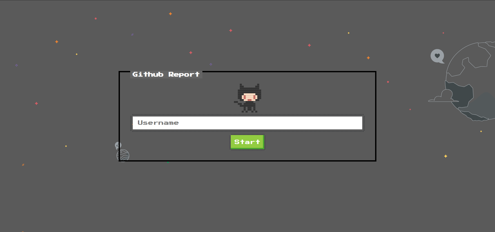
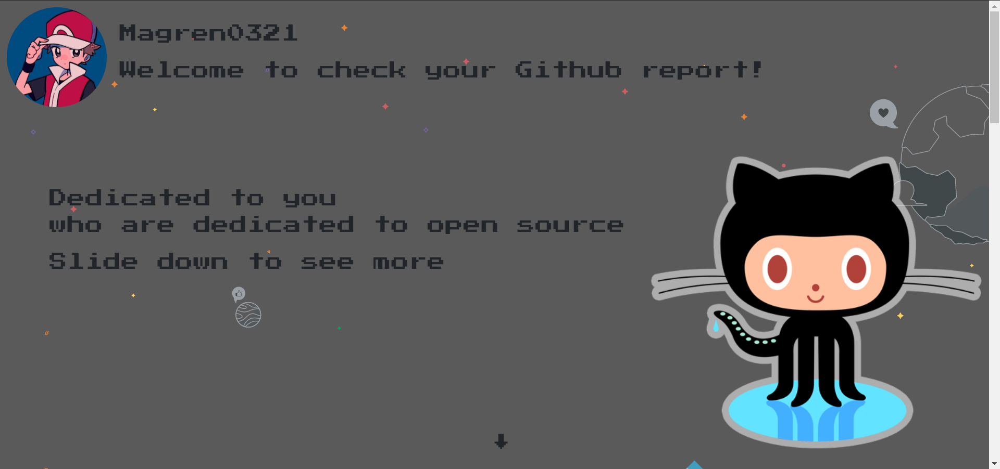
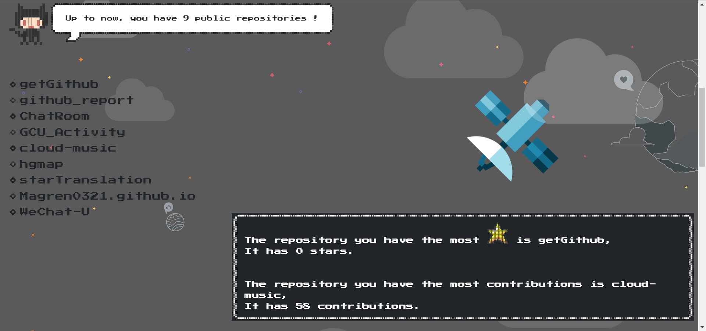
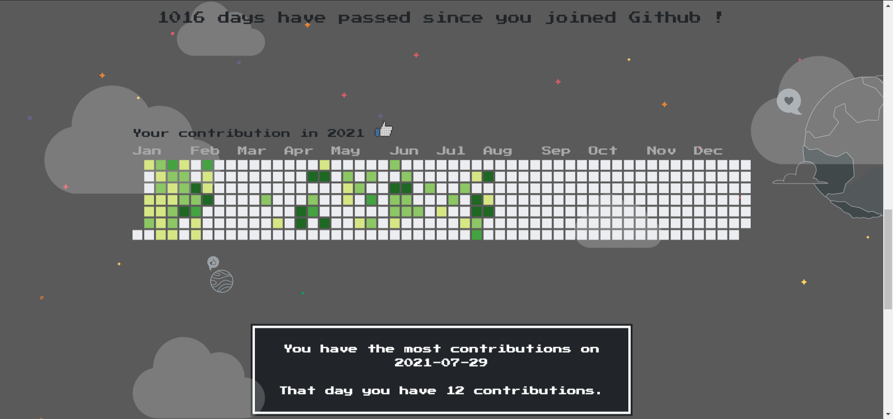

## 前言🛸

> GitHub是通过Git进行版本控制的软件源代码托管服务平台，由GitHub公司（曾称Logical Awesome）的开发者Chris Wanstrath、P. J. Hyett和汤姆·普雷斯顿·沃纳使用Ruby on Rails编写而成。截止到2020年1月，GitHub已经有超过4000万注册用户和1.9亿代码库（包括至少2800万开源代码库），事实上已经成为了世界上最大的代码存放网站和开源社区。

Github作为世界上最大的开源社区，对我编程的学习可以说是举足轻重的，~~曾用它抄别人代码来度过作业的危机，~~ 在之前使用Puppeteer尝试爬取了Github的部分数据，~~于是脑子一抽，~~ 灵光一闪，决定配合之前写的后台，结合下自己想尝试的react函数式组件去写一个页面来展示一个人Github的一些数据。

项目地址：[Github Report](https://github.com/Magren0321/github_report)

<!--more-->









## NES.css🚀

NES是20世纪80年代末、90年代初进入中国，是80后最早接触的游戏机，俗称红白机，这是一台使用8位处理器的游戏主机，而NES.css是一款NES风格（8位机）的CSS框架，也是一款像素风的CSS元件库,它没有任何 JavaScript 依赖,只包含CSS。

NES.css提供的组件样式很对我胃口，它还提供了一些很好玩的像素icon。NES.css在默认里只有英文字体是像素风格的，如果是需要别的语言也是像素风格的话，需要自行去下载字体。

👀具体使用参考看官方文档：[NES.css](https://github.com/nostalgic-css/NES.css)

## React-spring🌏

在最一开始我就想做一个整页滚动的效果，我每个页面都是100vh，隐藏掉滚动条后监听鼠标滚动（移动端监听touch），滚动执行的方法是整个页面上滑或则下滑100vh（使用margin-top，超出的部分隐藏，并且设置transition来使其有一个动画的效果），同时用时间戳实现了一个节流（单位时间内只执行一次某个方法），以防止用户频繁滚动✍：

```js
function throttle(event, time) {
	let pre = 0;
	return function (...args) {
		if (Date.now() - pre > time) {
			pre = Date.now();
			event.apply(this, args);
		}
	};
}
```

效果是有的，但是又感觉有点普通了🤨，接着翻到React-spring文档里看到了Parallax，Parallax可以创建一个可以滚动的容器，然后使用ParallaxLayer包含内容，并且可以设置其偏移量以及速度，就是可以制造视差滚动（页面上很多的元素在相互独立地滚动着），觉得挺好看就立马采用了😆。

在网上有看到过使用background-attachment（背景图像的位置是在视口内固定，还是随着包含它的区块滚动），以及transform（通过设置translateZ，滚动的上下距离也就不一样）来实现，但是看react-spring中的Parallax是使用js实现的，通过监听滚动，实时使用translate设定位置🤔

有时间得要好好看下，文档在这👉：[React-spring](https://react-spring.io/)

## React Hook📡

既然是使用了react的函数式组件，那么肯定就绕不开它的钩子函数了。说几个我常用的吧。

### useState

为函数式组件引入state，这个函数返回一个数组，数组第一个元素是变量，第二个元素是一个方法，用于改变变量，例如：

```js
// 声明一个叫 “count” 的 state 变量
const [count, setCount] = useState(0);
```

### useEffect

useEffet这个钩子函数可以说是替换了componentDidMount, componentDidUpdate, componentWillUnmount 这三个生命周期，在组件第一次渲染的时候也会执行useEffect()，具体✍：

```js
useEffect(
	//等价于 componentDidMount
	() => {
		// return等价于 componentWillUnmount
		return () => {};
	},
	// 依赖列表，当变更时候，执行useEffent()，等价于 componentDidUpdate
	[],
);
```

#### useContext

useContext()可以使用在组件之间需要共享状态的情况下，不必显式地通过组件树的逐层传递 props

```js
const themes = {
	light: {
		foreground: "##000000",
		background: "##eeeeee",
	},
	dark: {
		foreground: "##ffffff",
		background: "##222222",
	},
};

const ThemeContext = React.createContext(themes.light);

function App() {
	return (
		<ThemeContext.Provider value={themes.dark}>
			<Toolbar />
		</ThemeContext.Provider>
	);
}
// 子级
function Toolbar(props) {
	return (
		<div>
			<ThemedButton />
		</div>
	);
}
// 孙级或更多级
function ThemedButton() {
	const theme = useContext(ThemeContext);
	return (
		<button style={{ background: theme.background, color: theme.foreground }}>
			I am styled by theme context!
		</button>
	);
}
```

### useRef

useRef 返回一个可变的 ref 对象，其 .current 属性被初始化为传入的参数（initialValue）。

返回的 ref 对象在组件的整个生命周期内持续存在，类似于一个 class 的实例属性，其可以很方便地保存任何可变值。

```js
function TextInputWithFocusButton() {
	const inputEl = useRef(null);
	const intervalRef = useRef();

	const onButtonClick = () => {
		// `current` 指向已挂载到 DOM 上的文本输入元素
		inputEl.current.focus();
	};

	useEffect(() => {
		const id = setInterval(() => {
			// ...
		});
		intervalRef.current = id;
		return () => {
			clearInterval(intervalRef.current);
		};
	});

	return (
		<>
			<input ref={inputEl} type="text" />
			<button onClick={onButtonClick}>Focus the input</button>
			// ...
		</>
	);
}
```

### Warning 🔒

- ✅只在最顶层使用Hook（不要在循环、条件或嵌套函数中使用Hook）
- ✅在React函数中调用Hook
- ✅在自定义Hook中调用其他Hook

以上是React Hook文档中的规则，原因就是React内部并不是真正保存state，它是通过调用顺序来跟踪state。

也就是说 **多个useState的调用是借由一个链表来维护的，通过索引来实现对多个state的识别。** 如果在if/else中调用Hook，当函数组件重新执行的时候可能会改变调用顺序，会导致错误。

这个过程：

- 第一次渲染，根据 useState 顺序，逐个声明 state 并且将其放入全局 Array 中。每次声明 state，都要将 cursor 增加 1。
- 每个事件都有对应游标的state值，任何state事件触发，都会修改state数组中对应的state值，触发再次渲染。cursor 被重置为 0。按照 useState 的声明顺序，依次拿出最新的 state 的值，视图更新。

## 最后🔭

感谢[NES.css](https://github.com/nostalgic-css/NES.css)以及[React-spring](https://react-spring.io/)🙏

这是我个人的心血来潮的学习项目，有改善的地方或者bug欢迎交流🙌

如果这个东西能帮到你学到点什么就是我的荣幸🔮
