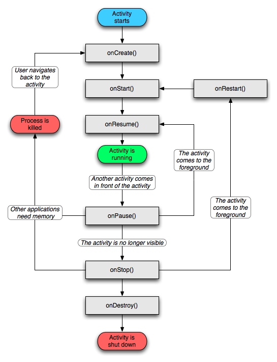

先上Google提供的经典图，是对Activity生命周期各个阶段之间导航转换的直观展现。
Activity类提供了六个核心回调：**onCreate()**、**onStart()**、**onResume()**、**onPause()**、**onStop()**和**onDestroy()**。


<!-- more -->

## 说明

- 在正常的情况下，Activity从启动到结束会按以下的顺序经历整个生命周期：onCreate()->onStart()->onResume()->onPause()->onStop()->onDestory()。
- onCreate():系统首次创建Activity的时候触发，可以做一些初始化的工作，比如初始化Activity所需要的数据，还有调用setContentView加载界面布局资源。
- onRestart()：表示Activity正在重新启动。一般情况下，当当前Activity从不可见重新变为可见状态时，onRestart就会被调用。这种情形一般是用户行为导致的，比如用户按Home键切换到桌面或打开了另一个新的Activity，接着用户又回到了这个Actvity。
- onStart(): 表示Activity正在被启动，即将开始，这时Activity已经出现了，**但是还没有出现在前台，无法与用户交互。**这个时候可以理解为Activity已经显示出来，但是我们还看不到。
- onResume():表示Activity已经可见了，并且出现在前台并开始活动。需要和onStart()对比，onStart的时候Activity还在后台，onResume的时候Activity才显示到前台。
- onPause():表示 Activity正在停止，仍可见，正常情况下，紧接着onStop就会被调，**onPause中不能进行耗时操作，会影响到新Activity的显示。因为onPause必须执行完，新的Activity的onResume才会执行。**
- onStop():表示Activity即将停止，不可见，位于后台。可以做稍微重量级的回收工作，同样不能太耗时。
- onDestory():表示Activity即将销毁，这是Activity生命周期的最后一个回调，可以做一些回收工作和最终的资源回收。

## 几种普遍情况

### 从A页面Activity跳转到B页面Activity，然后关闭B页面Activity，回到A页面Activity

- 针对开启的B页面Activity，第一次启动，回调如下：onCreate()->onStart()->onResume()
- 用户打开B页面Activiy的时候，A页面的Activity**处于不可见**的回调如下：onPause()->onStop()
- 再次从B页面回到A页面原Activity时，A页面从**不可见到可见**回调如下：onRestart()->onStart()->onResume()
- 按back键回退时，B页面Activity回调如下：onPause()->onStop()->onDestory()
- 按Home键切换到桌面后又回到A页面该Actitivy，回调如下：onPause()->onStop()->onRestart()->onStart()->onResume()
- 调用finish()方法后，回调如下：onDestory()**(以在onCreate()方法中调用为例，不同方法中回调不同，通常都是在onCreate()方法中调用)**

## Activity的三种运行状态

### Resumed（活动状态）

> 又叫Running状态，这个Activity正在屏幕上显示，并且有用户焦点。这个很好理解，就是用户正在操作的那个界面。

### Paused（暂停状态）

> 这是一个比较不常见的状态。这个Activity在屏幕上是可见的，但是并不是在屏幕最前端的那个Activity。比如有另一个非全屏或者透明的Activity是Resumed状态，没有完全遮盖这个Activity。

### Stopped（停止状态）

> 当Activity完全不可见时，此时Activity还在后台运行，仍然在内存中保留Activity的状态，并不是完全销毁。这个也很好理解，当跳转的另外一个界面，之前的界面还在后台，按回退按钮还会恢复原来的状态，大部分软件在打开的时候，直接按Home键，并不会关闭它，此时的Activity就是Stopped状态。

## 部分流程分支

- 启动Activity: onCreate()—>onStart()—>onResume()，Activity进入运行状态。
- Activity退居后台: 当前Activity转到新的Activity界面或按Home键回到主屏： onPause()—>onStop()，进入停滞状态。
- Activity返回前台: onRestart()—>onStart()—>onResume()，再次回到运行状态。
- Activity退居后台，且系统内存不足， 系统会杀死这个后台状态的Activity（此时这个Activity引用仍然处在任务栈中，只是这个时候引用指向的对象已经为null），若再次回到这个Activity,则会走onCreate()–>onStart()—>onResume()(将重新走一次Activity的初始化生命周期)
- 锁屏：onPause()->onStop()
- 解锁：onStart()->onResume()

## 横竖屏下切换

### 第一种情况，销毁当前的Activity：

在横竖屏切换的过程中，Activity会先销毁后重建，也应该避免这种情况。
这里有两个回调：

- onSaveInstanceState和onRestoreInstanceState。
- 在Activity由于异常情况下终止时，系统会调用onSaveInstanceState来保存当前Activity的状态。这个方法的调用是在onStop之前，它和onPause没有既定的时序关系，该方法只在Activity被异常终止的情况下调用。当异常终止的Activity被重建以后，系统会调用onRestoreInstanceState，并且把Activity销毁时onSaveInstanceState方法所保存的Bundle对象参数同时传递给onRestoreInstanceState和onCreate方法。因此，可以通过onRestoreInstanceState方法来恢复Activity的状态，该方法的调用时机是在onStart之后。其中onCreate和onRestoreInstanceState方法来恢复Activity的状态的区别： onRestoreInstanceState回调则表明其中Bundle对象非空，不用加非空判断。onCreate需要非空判断。建议使用onRestoreInstanceState。
- 简单来说，这个过程Activity的生命周期为：onPause()->onSaveInstanceState()-> onStop()->onDestroy()->onCreate()->onStart()->onRestoreInstanceState->onResume()

### 第二种情况，当前的Activity 不销毁，但是我们需要设置Activity的属性：

可以通过在AndroidManifest文件的Activity中指定如下属性：

```java
<activity
    android:name=".activity.VideoDetailActivity"
    android:configChanges="orientation|keyboardHidden|screenSize"
    android:screenOrientation="portrait"/>
```

通过回调下面的方法，避免横竖屏切换的时候Activity的销毁和重建：

```java
@Override
public void onConfigurationChanged(Configuration newConfig) {
    super.onConfigurationChanged(newConfig);
}
```

## 当资源不足的时候，保留Activity的优先级顺序：

- 前台Activity——正在和用户交互的Activity，优先级最高。
- 可见但非前台Activity——比如Activity中弹出了一个对话框，导致Activity可见但是位于后台无法和用户交互。
- 后台Activity——已经被暂停的Activity，比如执行了onStop，优先级最低。
