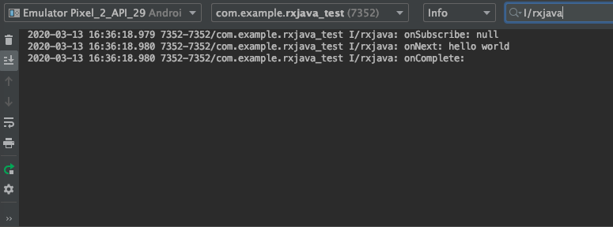

RxJava是利用观察者模式来实现一些列的操作，所以对于观察者模式中的观察者，被观察者，以及订阅、事件需要有一个了解。

Observable：在观察者模式中称为“被观察者”；
Observer：观察者模式中的“观察者”，可接收Observable发送的数据；
subscribe：订阅，观察者与被观察者，通过Observable的subscribe()方法进行订阅；
Subscriber：也是一种观察者，在2.0中 它与Observer没什么实质的区别，不同的是 Subscriber要与Flowable(也是一种被观察者)联合使用，Obsesrver用于订阅Observable，而Subscriber用于订阅Flowable.

<!--more-->

## 观察者模式

rxjava的实现主要是通过观察者模式实现的。

A 对象（观察者）对 B 对象（被观察者）的某种变化高度敏感,需要在 B 变化的一瞬间做出反应.
在程序的观察者模式，观察者不需要时刻盯着被观察者,而是采用注册或者称为订阅的方式，告诉被观察者：我需要你的某某状态，你要在它变化的时候通知我
同时我们也可以多个观察者对应一个被观察者

其实在android中也有很多自带的观察者模式。最明显的莫过于点击事件。说个最简单的例子，点击按钮后弹一个Toast。那么，我们在点击按钮的时候，告知系统，此时，我需要弹一个吐司。那么就这么弹出来了。那么，这个时候问题来了。我是否需要实时去监听这个按钮呢？答案是不需要的。这就和前面的举例有的差距了。换句话说。我只要在此按钮进行点击时进行监听就可以了。这种操作被称为订阅。也就是说Button通过setOnClickListener对OnclickListener进行了订阅了操作，来监听onclick方法。

## 基本使用

rxjava的基本实现主要是三点：

- 初始化 Observable （被观察者）
- 初始化 Observe（观察者）
- 建立两者之间的订阅关系

### 创建Observable

```java
Observable<String> observable = Observable.create(new ObservableOnSubscribe<String>() {
            @Override
            public void subscribe(ObservableEmitter<String> e) throws Exception {
                e.onNext("hello world");
                e.onComplete(); //调用complete后下面将不再接受事件
            }
        });
```

### 创建Observe

```java
 Observer<String>observer=new Observer<String>() {
            @Override
            public void onSubscribe(Disposable d) {
                Log.i("rxjava", "onSubscribe: " + d);
            }

            @Override
            public void onNext(String string) {
                Log.i("rxjava", "onNext: " + string);
            }

            @Override
            public void onError(Throwable e) {
                Log.i("rxjava", "onError: " + e);
            }

            @Override
            public void onComplete() {
                Log.i("rxjava", "onComplete: ");
            }
        };
```

- onSubscribe：它会在事件还未发送之前被调用，可以用来做一些准备操作。而里面的Disposable则是用来切断上下游的关系的。
- onNext：普通的事件。将要处理的事件添加到队列中。
- onError：事件队列异常，在事件处理过程中出现异常情况时，此方法会被调用。同时队列将会终止，也就是不允许在有事件发出。
- onComplete：事件队列完成。rxjava不仅把每个事件单独处理。而且会把他们当成一个队列。当不再有onNext事件发出时，需要触发onComplete方法作为完成标识。

### 创建订阅

observable.subscribe(observer);

### 结果

先调用onSubscribe，然后走了onNext，最后以onComplete收尾：


## 线程的调度

- subscribeOn() 指定的是发射事件的线程，observerOn 指定的就是订阅者接收事件的线程。
- 多次指定发射事件的线程只有第一次指定的有效，也就是说多次调用 subscribeOn() 只有第一次的有效，其余的会被忽略。
- 但多次指定订阅者接收线程是可以的，也就是说每调用一次 observerOn()，下游的线程就会切换一次。

rxjava中已经内置了一些线程供我们选择：

- Schedulers.io() 代表io操作的线程, 通常用于网络,读写文件等io密集型的操作
- Schedulers.computation() 代表CPU计算密集型的操作, 例如需要大量计算的操作
- Schedulers.newThread() 代表一个常规的新线程
- AndroidSchedulers.mainThread() 代表Android的主线程

### 例子：

```java
Observable<String> observable = Observable.create(new ObservableOnSubscribe<String>() {
            @Override
            public void subscribe(ObservableEmitter<String> e) throws Exception {
                e.onNext("hello world   "+ Thread.currentThread().getName());
                e.onComplete(); //调用complete后下面将不再接受事件
            }
        }).subscribeOn(Schedulers.newThread())
                .observeOn(AndroidSchedulers.mainThread()) //切换到主线程
                .doOnNext(new Consumer<String>() {
                    @Override
                    public void accept(String s) throws Exception {
                        Log.i("rxjava","主线程   "+Thread.currentThread().getName());
                    }
                })
                .observeOn(Schedulers.io())
                .doOnNext(new Consumer<String>() {
                    @Override
                    public void accept(String s) throws Exception {
                        Log.i("rxjava","thread   "+Thread.currentThread().getName());
                    }
                });
```

### 结果

```
2020-03-13 17:06:23.873 8760-8760/com.example.rxjava_test I/rxjava: onSubscribe: io.reactivex.internal.operators.observable.ObservableDoOnEach$DoOnEachObserver@92153c7
2020-03-13 17:06:23.980 8760-8760/com.example.rxjava_test I/rxjava: 主线程   main
2020-03-13 17:06:23.982 8760-8826/com.example.rxjava_test I/rxjava: thread   RxCachedThreadScheduler-1
2020-03-13 17:06:23.982 8760-8826/com.example.rxjava_test I/rxjava: onNext: hello world   RxNewThreadScheduler-1
2020-03-13 17:06:23.982 8760-8826/com.example.rxjava_test I/rxjava: onComplete:
```

## 结合rxjava和retorfit

### 创建接收服务器返回数据的类

```java
public class TranslationBean {

    private int errorCode; //错误返回码
    private String query;     //源语言
    private List<String> translation; //翻译结果
    private basicEntity basic;
    private List<WebEntity> web;
    private String tSpeakUrl;

    public class basicEntity {
        @SerializedName("us-phonetic")
        private String usPhonetic;  //英式音标
        @SerializedName("uk-speech")
        private String ukSpeech;    //美式发音
        @SerializedName("us-speech")
        private String usSpeech;  //英式发音
        private String phonetic;   //默认音标
        @SerializedName("uk-phonetic")
        private String ukPhonetic;   //美式英标

        private List<String> explains;  //基本释义


        public List<String> getExplains() {
            return explains;
        }

        public void setExplains(List<String> explains) {
            this.explains = explains;
        }

        public String getPhonetic() {
            return phonetic;
        }

        public void setPhonetic(String phonetic) {
            this.phonetic = phonetic;
        }

        public String getUkPhonetic() {
            return ukPhonetic;
        }

        public void setUkPhonetic(String ukPhonetic) {
            this.ukPhonetic = ukPhonetic;
        }

        public String getUsPhonetic() {
            return usPhonetic;
        }

        public void setUsPhonetic(String usPhonetic) {
            this.usPhonetic = usPhonetic;
        }

        public String getUkSpeech() {
            return ukSpeech;
        }

        public void setUkSpeech(String ukSpeech) {
            this.ukSpeech = ukSpeech;
        }

        public String getUsSpeech() {
            return usSpeech;
        }

        public void setUsSpeech(String usSpeech) {
            this.usSpeech = usSpeech;
        }

    }
    public class WebEntity {
        private String key;
        private List<String> value;

        public void setKey(String key) {
            this.key = key;
        }

        public void setValue(List<String> value) {
            this.value = value;
        }

        public String getKey() {
            return key;
        }

        public List<String> getValue() {
            return value;
        }
    }
    public void setQuery(String query) {
        this.query = query;
    }

    public void setErrorCode(int errorCode) {
        this.errorCode = errorCode;
    }

    public void setTranslation(List<String> translation) {
        this.translation = translation;
    }

    public void setWeb(List<WebEntity> web) {
        this.web = web;
    }

    public String getQuery() {
        return query;
    }

    public int getErrorCode() {
        return errorCode;
    }

    public List<String> getTranslation() {
        return translation;
    }

    public List<WebEntity> getWeb() {
        return web;
    }

    public basicEntity getBasic() {
        return basic;
    }

    public void setBasic(basicEntity basic) {
        this.basic = basic;
    }

    public void settSpeakUrl(String tSpeakUrl){ this.tSpeakUrl = tSpeakUrl;}

    public String gettSpeakUrl(){ return tSpeakUrl; }
}
```

### 创建用于描述网络请求的接口

```java
public interface networkApi {
    @GET("api?")
    Observable<TranslationBean> translateYouDao(
            @Query("q") String q,
            @Query("from") String from,
            @Query("to") String to,
            @Query("appKey") String appKey, //应用ID
            @Query("salt") String salt,  //UUID
            @Query("sign") String sign,  //应用ID+input+salt+curtime+应用密钥 。 input= q前10个字符+q长度+q后10个字符（q的长度>=20） 或input = 字符串
            @Query("signType") String signType, //签名类型
            @Query("curtime") String curtime //时间戳
    );
}
```

### 创建Retorfit

```java
public class netWork {
    private static networkApi sContactsApi;
    private static OkHttpClient okHttpClient = new OkHttpClient();
    private static Converter.Factory gsonConverterFactory = GsonConverterFactory.create();
    private static CallAdapter.Factory rxJavaCallAdapterFactory = RxJava2CallAdapterFactory.create();

    private static class ApiClientHolder {
        public static final netWork INSTANCE = new netWork();
    }

    public static netWork getInstance() {
        return ApiClientHolder.INSTANCE;
    }

    public networkApi getDataService() {
        if (sContactsApi == null) {
            Retrofit retrofit = new Retrofit.Builder()
                    .client(okHttpClient)
                    .baseUrl(Constants.BASE_URL)
                    .addConverterFactory(gsonConverterFactory)
                    .addCallAdapterFactory(rxJavaCallAdapterFactory)
                    .build();
            sContactsApi = retrofit.create(networkApi.class);
        }
        return sContactsApi;
    }

}
```

### 使用

```java
@SuppressLint("CheckResult")
   public void netConnection(String q,String from,String to,String salt,String sign,String curtime){
       netWork.getInstance().getDataService()
               .translateYouDao(q,from,to,appID,salt,sign,signType,curtime)
               .subscribeOn(Schedulers.newThread()) //发起的执行在一个新的线程
               .observeOn(AndroidSchedulers.mainThread()) //结果的执行在主线程
               .subscribe(new Consumer<TranslationBean>() {
                   @Override
                   public void accept(TranslationBean translationBean) throws Exception {
                       //对接收到数据的类进行处理
                   }
               });
   }
```
