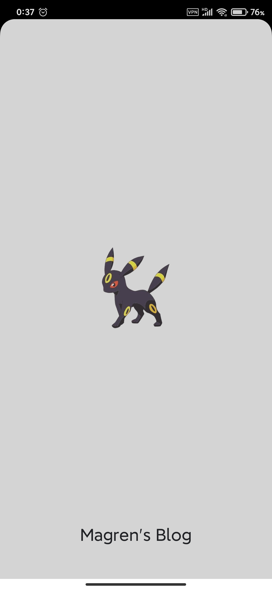
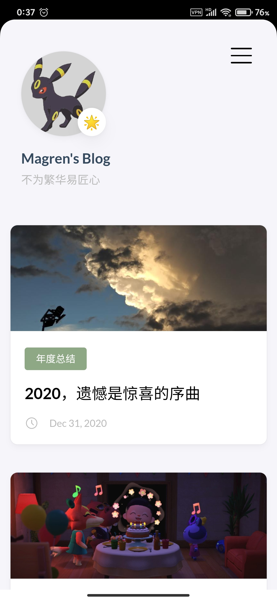

我是[少数派](https://sspai.com/)的一个读者，**成为少数派已经419天**。

从少数派里面学到了很多东西，也丰富了自己的眼界，所以少数派APP也是我手机上的常用应用之一，在去年将手机换成了Android后，发现到现在为止Android的APP已经很久没有更新过了，Android客户端一直处于一个“年久失修”的状态，反倒是IOS的一直在更新迭代，更新了UI以及一些新的功能，这让我十分眼红。

但是在少数派3月31号发布的文章中，他们为Android客户端做出了一个解释，并且提出了一个**更优解**。

> 继去年少数派网站改版升级后，更符合新版设计的少数派 iOS 客户端 2.0 也在不久前正式上线。可惜由于开发能力实在有限，Android 平台繁杂的机型适配和兼容性问题也着实令人头疼，少数派的 Android 客户端此前一直处于「年久失修」的状态。
>
> 好在少数派最终为 Android 客户端找到了一个「更优解」——渐进式网页应用（以下简称 PWA）。在保证内容呈现完整的前提下，PWA 有着比客户端应用更轻量、比网页版功能更强大的全新体验，同时还能兼容 Android、iOS 甚至 Windows 等多个平台。

关于PWA这个概念我是第一次知道，抱着新奇的态度开始Google……

<!--more-->

## 关于PWA

PWA 是 Google 于 2016 年提出的概念，于 2017 年正式落地，于 2018 年迎来重大突破，全球顶级的浏览器厂商，Google、Microsoft、Apple 已经全数宣布支持 PWA 技术。

PWA 全称为 Progressive Web App，中文译为渐进式 Web APP，其目的是通过各种 Web 技术实现与原生 App 相近的用户体验。

纵观现有 Web 应用与原生应用的对比差距，如离线缓存、沉浸式体验等等，可以通过已经实现的 Web 技术去弥补这些差距，最终达到与原生应用相近的用户体验效果。

好吧说完上面的官方发言，地道一点说下我自己的体验，就是一个Web页面拿掉了浏览器的壳子，以一个近似app的形式存在手机桌面，与一般的将网页添加到桌面不同，它还有本地通知的能力以及一个缓存的能力，除此以外它可以兼容Android、IOS以及Windows多个平台，对我来说它在打开的时候还有一个页面logo闪屏，很有吸引力。

## 将自己的博客变成PWA

在体验过[少数派的PWA](https://pwa.sspai.com/)后，我萌生了能否把自己的博客变成PWA的想法，在网上查询了资料后发现入门意外的简单，接下来说说我自己的操作。

### 添加 manifest.json

这里新建一个manifest.json文件，主要是配置应用图标以及名称等信息，然后这里分享下我的配置，具体的配置介绍可以参考下[MDN](https://developer.mozilla.org/zh-CN/docs/Web/Manifest)。

```js
{
    "dir": "ltr", //指定名称、短名称和描述成员的主文本方向
    "lang": "zh-cn", //语言
    "name": "Magren's Blog", //名字
    "short_name": "Magren's Blog", //短名称
    "theme_color": "##ffffff", //主题颜色
    "background_color": "##d4d4d4", //启动时闪屏的背景颜色
    "display": "standalone", //定义开发人员对Web应用程序的首选显示模式。
    "start_url": "./index.html", //开始加载的url
    "icons": [ //程序图标
      {
        "src": "avatar152.png",
        "sizes": "152x152",
        "type": "image/png"
      },
      {
        "src": "avatar192.png",
        "sizes": "192x192",
        "type": "image/png"
      },
      {
        "src": "avatar384.png",
        "sizes": "384x384",
        "type": "image/png"
      },
      {
        "src": "avatar512.png",
        "sizes": "512x512",
        "type": "image/png"
      }
    ],
    "splash_pages": null
  }
```

接着就要在我们的HTML文件中引入啦，如果你也是博客的话就去翻翻你的主题文件夹，在里面找下吧。

```html
<link rel="manifest" href="manifest.json" />
```

### 添加 Service Worker

这个API是用来实现页面缓存和离线，还有后台通知，不过因为这就是我的一个个人博客，所以我没有加上通知的功能。

首先判断浏览器是否支持serviceWorker，如果支持则调用函数来注册站点的service worker，service worker 只是一个驻留在我们的 app 内的一个 JavaScript 文件。

在html的页面下加上：

```js
    <script>
        if ('serviceWorker' in navigator) {
            window.addEventListener('load', function () {
                navigator.serviceWorker.register('/sw.js', {scope: '/'})
                    .then(function (registration) {
                        // 注册成功
                        console.log('ServiceWorker registration successful');
                    })
                    .catch(function (err) {
                        // 注册失败:(
                        console.log('ServiceWorker registration failed');
                    });
            });
        }
    </script>
```

接着是sw.js，即我们的serviceWorker，这里可以定义需要缓存的路径, 以及需要缓存的静态文件的列表, 这个列表也可以通过 Webpack 插件生成，我这里就只缓存了首页。

```js
//监听service worker事件
self.addEventListener("install", function (event) {
	var homePage = new Request("index.html");
	event.waitUntil(
		//请求首页并将首页存入缓存
		fetch(homePage).then(function (response) {
			//建立cache-homePage缓存
			return caches.open("cache-homePage").then(function (cache) {
				return cache.put(homePage, response);
			});
		}),
	);
});

//请求页面
self.addEventListener("fetch", function (event) {
	event.respondWith(
		fetch(event.request).catch(function (error) {
			//请求失败，从缓存中读取缓存的页面
			return caches.open("cache-homePage").then(function (cache) {
				return cache.match("index.html");
			});
		}),
	);
});

//刷新首页
self.addEventListener("refreshHomePage", function (response) {
	return caches.open("cache-homePage").then(function (cache) {
		//将刷新后的页面缓存
		return cache.put(offlinePage, response);
	});
});
```

## 最后

最后说说如何使用pwa吧，在手机上，只需通过支持的浏览器（如 Chrome以及小米自带的浏览器）访问 PWA 页面地址，Chrome会在加载完页面后弹出添加页面的提示，如果没有的话（如IOS的Safari），需要手动点击浏览器的更多，然后直接添加到桌面上即可。

PC端的话Chrome的右上角（网页链接的最右端）有一个下载按钮，点击后就会添加到电脑桌面。如果要卸载的话只是删除电脑桌面的快捷方式是不可以的，需要打开来然后在PWA页面的上方点击卸载按钮。

