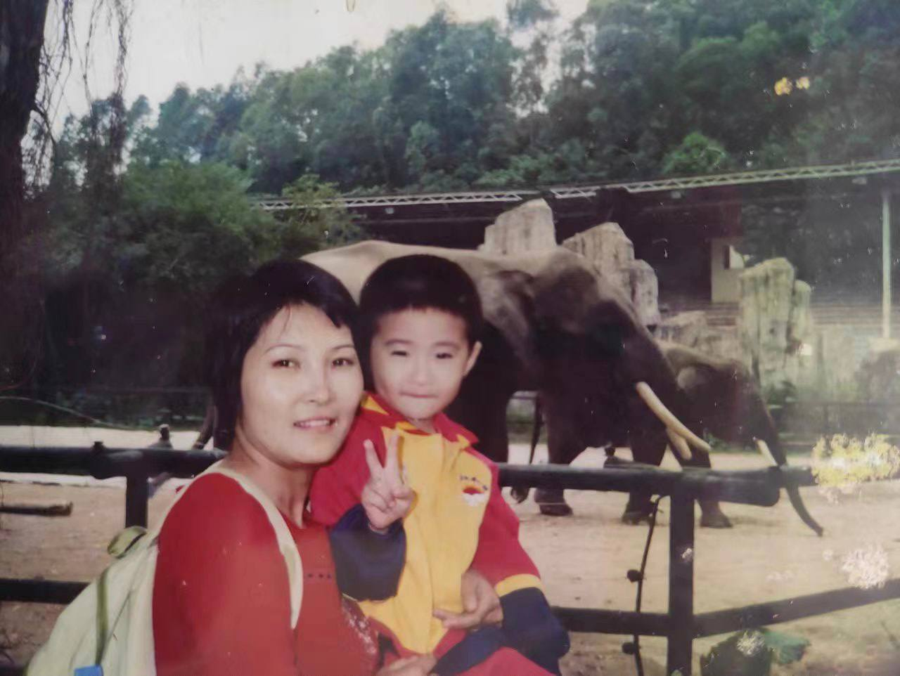

> "生日快乐！愿你在新的一岁里，能够继续前行，充满自信和勇气，实现更多的梦想和目标。" - 《狼与香辛料》

<!--more-->

既然是在自己诞生的日子，那就还是简单说说自己吧。📖

## 23岁🎂

在今天的0点过后，意味着我又长大了一岁，过去的二十几年里我过的浑浑噩噩，每时每刻都是困惑，然而现在依然如此，诶嘿。

我从以前开始对自己的长期目标或者计划就很迷糊，尽管有着一个较长期的目标，但是往往都是个大方向，也没有想好具体的过程，哪怕想好也依然是缺斤少两，~~所以往往干脆不想了~~。

这可能不是什么好事，意味着整个过程会难把控，或许最后会与我最初的设想偏离，甚至南辕北辙。

以前的我往往会对此懊恼，为什么一步一步走来跟自己设想的目标相差甚远，当出现偏差或者失意的时候我都感到焦虑，没有按着计划走。😶‍🌫️

> **_很不幸，时间的流逝永远不会停止。_** > **_时光如箭，你的过去在不停增多，你的未来在不断减少，未知的可能性只会越来越少，而无法改变的后悔在累积如山。_** > **_你明白了吗？_**

但是人终究不是机器，所处的环境也不是机器，没一步都不可能精准的执行，许多事情也不是努力或者按部就班就可以达成的。

在21年我生日那天我写下了**【与自己和解】**，现在我想我做到了一些，无论发生不发生变数，时间都在走，与其在意一些糟糕的事情，还是先让自己忙碌起来吧，如果当初的自己已经努力了，无论什么结果都不该怪当初努力的自己。

时间是有限的，我想尽可能的少在悲伤之中。

## 自己与他人🧑🏻‍🤝‍🧑🏻

我自认为我是一个比较内敛的人（至少在不熟的人面前是的🐶），我常交流的圈子里边跟我的环境有关，印象中自我上了高中后，跟初中的人联系就少了，上了大学就跟大学的人常联系，现在就跟工作的人常联系，几年下来一直联系的人少之又少。

但是这并不代表我把一些人或者发生的事遗忘，他们在我的心里依然占据着朋友的位置，只是我往往不会主动去联系，大家都有着各自的生活。如果哪天能在街上碰巧遇到依然能笑着打招呼，我想这是能让我十分开心的事。

~~如果各位大老板们公司缺看大门的，可以给我留个位置，苟富贵，勿~~

## 最后

写到最后发现自己也只是写了一篇流水账，不过也没关系，事物的意义都是人为赋予的，这篇文章确实记录了23岁的我。

> _仅以此文献给自己，祝自己生日快乐_

