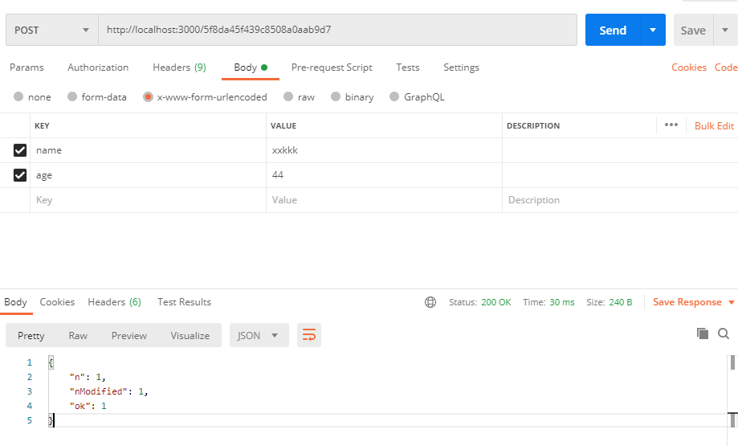
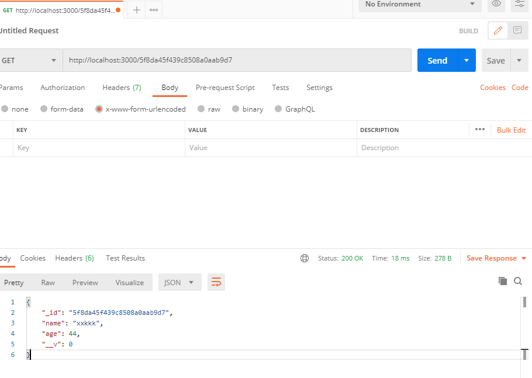

前一段时间学习了node.js操作mongoDB数据库，现在追加一篇写接口的记录。

<!-- more -->

## 链接数据库

在项目根目录下安装Mongoose

> npm install mongoose --save

利用mongoose来链接MongoDB 在项目中创建**db.js**文件：

```js
"use strict";

import mongoose from "mongoose";

mongoose.connect("mongodb://localhost:27017/test", {
	useNewUrlParser: true,
	useUnifiedTopology: true,
});

const db = mongoose.connection;

db.once("open", () => {
	console.log("连接数据库成功");
});

db.on("error", function (error) {
	console.error("Error in MongoDb connection: " + error);
	mongoose.disconnect();
});

db.on("close", function () {
	console.log("数据库断开，重新连接数据库");
});

export default db;
```

## 创建数据模型（建一张表）

在test数据库中创建一张名为**StudentSchema**的表，表中有name和age字段，并且公出。

```js
import mongoose from "mongoose";

//创建schema
const StudentSchema = new mongoose.Schema({
	name: String,
	age: Number,
});

const studentSchema = mongoose.model("StudentSchema", StudentSchema);

export default studentSchema;
```

## 接口路由搭建

添加body-parser依赖:

> npm install body-parser

在app.js中引入：

```js
import bodyParser from "body-parser";

//使用body-parser中间件
app.use(bodyParser.urlencoded({ extended: false }));
app.use(bodyParser.json());
```

新建一个js文件，用于写数据接口 req.body指的是URL中的参数，req.params指的是路径

```js
import express from "express";
import studentInfo from "./studentInfo";

const router = express.Router();

router.get("/test", (req, res) => {
	res.json({ msg: "接收成功" });
	//示例：http://localhost:3000/test
});

//添加一条数据
router.post("/add", (req, res) => {
	const Student = {};
	if (req.body.name) {
		Student.name = req.body.name;
	}
	if (req.body.age) {
		Student.age = req.body.age;
	}
	new studentInfo(Student).save().then((user) => {
		res.json(user);
	});
});

//根据id删除一条数据
router.post("/delete", (req, res) => {
	studentInfo.remove({ _id: req.body.id }).then((result) => {
		res.json(result);
	});
});

//获取一条数据
router.get("/:id", (req, res) => {
	studentInfo
		.findOne({ _id: req.params.id })
		.then((user) => {
			if (!user) {
				return res.status(400).json("没有任何数据存在");
			}
			return res.json(user);
		})
		.catch((err) => {
			return res.status(404).json(err);
		});
});

//更新一条数据
router.post("/:id", (req, res) => {
	const Student = {};
	if (req.body.name) {
		Student.name = req.body.name;
	}
	if (req.body.age) {
		Student.age = req.body.age;
	}
	studentInfo
		.updateOne({ _id: req.params.id }, { $set: Student })
		.then((user) => {
			if (!user) {
				return res.status(400).json("数据不存在");
			}
			res.json(user);
		})
		.catch((err) => {
			return res.status(404).json(err);
		});
});

module.exports = router;
```

## 使用

在app.js中引入：

```js
import test from "./test";

app.use(test);
```

## 利用Postman测试

### POST测试：

将POST的body设置成**x-www-form-urlencoded**，下图为更新数据的接口示例： 

### GET测试：

下图为根据ID获取一条数据的示例

