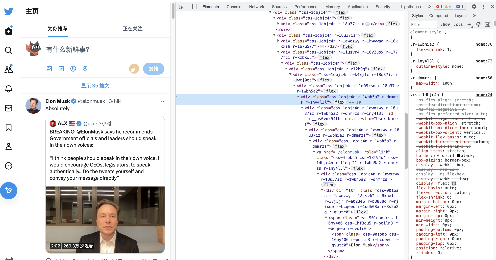
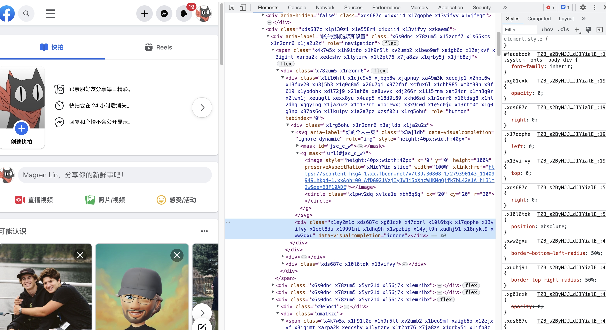
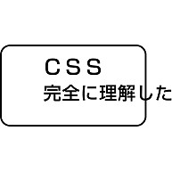

> “有了这个玩意，我可能不用引入css预处理语言，毕竟我可能不写css。” —— 我自己说的

<!--more-->

## Atomic CSS（原子 CSS）

在知道Tailwind CSS之前，得先知道一个概念，就是原子 CSS，它的概念解释起来十分简单，**即所有 CSS 类都有一个唯一的 CSS 规则。**

这样写的方法有一些好处

- **不会出现样式冲突**，因为每个类都是唯一的，不会有重复的类名。
- 同时移动html元素的时候，也不会出现样式丢失的情况。
- 删除新特性的时候，也能够确保其样式同时被删除。

```css
/* 原子 CSS */
.bw-2x {
	border-width: 2px;
}
.bss {
	border-style: solid;
}
.sans {
	font-style: sans-serif;
}
.p-1x {
	padding: 10px;
}
```

在使用这种写法之前，我们需要先定义好一些常用的类名，比如上面的`.bw-2x`，`.bss`，`.sans`，`.p-1x`，然后才可以进行开发，如果这一套样式是由别人写好的，我们也不得不去学习这一套样式，并且学习其类名的约定，这样就会增加我们的学习成本。甚至我们需要的样式是这一套样式中没有的，那么我们就需要自己去写。

## Tailwind CSS

> ~~神说：要有样式，于是有了Tailwind CSS~~
> 神说：要有光，于是有了光。

[Tailwind CSS](https://tailwindcss.com/)提供了一些公用的命名约定。通过一个[配置文件](https://tailwindcss.com/docs/configuration)，你可以为你的网站生成一套专属的实用工具 CSS。它是一套完整的设计系统，需要能提供开箱即用的功能，满足 80% 的业务场景；同时需要支持良好的扩展机制，满足另外 20% 的业务场景。

### 自定义配置

Tailwind CSS提供了一些配置项，可以在`tailwind.config.js`中进行配置。当一个项目的UI设计已经有了一套明确的规范（字体大小、主题色、按钮大小等），我们可以通过配置文件来生成一套符合规范的CSS类名。

```javascript
// tailwind.config.js 官网实例配置
module.exports = {
	content: ["./src/**/*.{html,js}"],
	theme: {
		colors: {
			blue: "##1fb6ff",
			purple: "##7e5bef",
			pink: "##ff49db",
			orange: "##ff7849",
			green: "##13ce66",
			yellow: "##ffc82c",
			"gray-dark": "##273444",
			gray: "##8492a6",
			"gray-light": "##d3dce6",
		},
		fontFamily: {
			sans: ["Graphik", "sans-serif"],
			serif: ["Merriweather", "serif"],
		},
		extend: {
			spacing: {
				"8xl": "96rem",
				"9xl": "128rem",
			},
			borderRadius: {
				"4xl": "2rem",
			},
		},
	},
};
```

### 支持任意值

Tailwind CSS提供了一套类名对应的样式，我们可以通过`w-1/2`来设置宽度为50%，也可以通过`w-1/3`来设置宽度为33.3333%，但是总有样式是框架没有提供的。

Tailwind CSS就提供了一种任意值的类名规则，如果我们需要设置宽度为50px，可以通过加入`w-[50px]`的类名来实现，这种方式对其他的CSS属性任意值也是同样适用的。

### 响应式设计

Tailwind 中的每个功能类都可以有条件的应用于不同的断点（有点像Bootstrap呢），这使得可以轻松的构建复杂的响应式界面而不用离开 HTML。 默认的情况下 Tailwind 会为你生成以下几个断点：

- sm 640px @media (min-width: 640px) { ... }
- md 768px @media (min-width: 768px) { ... }
- lg 1024px @media (min-width: 1024px) { ... }
- xl 1280px @media (min-width: 1280px) { ... }
- 2xl 1536px @media (min-width: 1536px) { ... }

### @apply 抽离/复用

由于需要做响应式，所以一个类名需要根据断点写多种去适应不同的尺寸。这样，一个标签里面难免会存在几十个类名，会影响代码的阅读体验，甚至后续也难以维护以及拓展。Tailwind CSS提供了@apply指令用于将现有的类名内联到自己自定义的css中。

```css
.my-class {
	@apply h-48 w-full text-lg font-bold text-gray-900;
}
```

### 文件会很大吗？

对的！因为它需要把所有的CSS属性全部都封装一遍，所以CSS文件巨大。于是Tailwind CSS在构建的过程中引用了`PurgeCSS`，以此找到所有未使用的类名，以确保他们不会一块被打包，所以打包构建不用担心文件会很大。

### 说说缺点

- 由于Tailwind CSS是基于类名的，所以在使用的时候，需要对类名有一定的了解，否则就会出现一些不必要的样式。
- 标签里边会有大量的类名，会显得丑陋，阅读体验不好，后期维护修改多少有点不便。
- 需要搭配UI规范，否则多人开发不好维护。

### 实际使用

#### html/css实现

```html
<div class="chat-notification">
	<div class="chat-notification-logo-wrapper">
		
	</div>
	<div class="chat-notification-content">
		<h4 class="chat-notification-title">ChitChat</h4>
		<p class="chat-notification-message">You have a new message!</p>
	</div>
</div>

<style>
	.chat-notification {
		display: flex;
		max-width: 24rem;
		margin: 0 auto;
		padding: 1.5rem;
		border-radius: 0.5rem;
		background-color: ##fff;
		box-shadow:
			0 20px 25px -5px rgba(0, 0, 0, 0.1),
			0 10px 10px -5px rgba(0, 0, 0, 0.04);
	}
	.chat-notification-logo-wrapper {
		flex-shrink: 0;
	}
	.chat-notification-logo {
		height: 3rem;
		width: 3rem;
	}
	.chat-notification-content {
		margin-left: 1.5rem;
		padding-top: 0.25rem;
	}
	.chat-notification-title {
		color: ##1a202c;
		font-size: 1.25rem;
		line-height: 1.25;
	}
	.chat-notification-message {
		color: ##718096;
		font-size: 1rem;
		line-height: 1.5;
	}
</style>
```

#### Tailwind CSS实现

看起来简单了很多😋

```html
<div class="mx-auto flex max-w-sm rounded-lg bg-white p-6 shadow-xl">
	<div class="flex-shrink-0">
		
	</div>
	<div class="ml-6 pt-1">
		<h4 class="text-xl leading-tight text-gray-900">ChitChat</h4>
		<p class="text-base leading-normal text-gray-600">You have a new message!</p>
	</div>
</div>
```

## 最后

原子化css个人感觉是个值得关注的趋势，目前Twitter、~~facebook~~ Meta等大厂都在使用。



如果团队是根据一套设计规范去进行设计的话，用Tailwind CSS会非常舒服。同时个人感觉用其写布局非常爽，几个 class 就可以解决问题，不需要再做无意义的命名。😆

这只是我个人使用的一些想法，如果感兴趣的话我建议亲自使用一下。✍️

这里也推荐下antfu写的 [Unocss](https://github.com/unocss/unocss) - 具有高性能且极具灵活性的即时原子化 CSS 引擎。

最后希望大家CSS完全理解。💡

