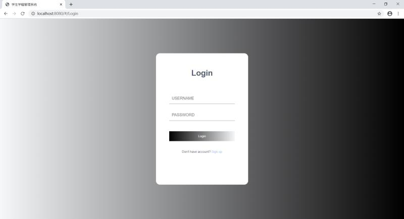

终于度过了紧张刺激的期末以及三个大作业两个大作业的答辩。
最没有把握的科目居然是这个学期唯一的开卷考——hadoop，考的东西我翻书也翻不到，虽然操作系统也挺难的，但好歹别人是46开（平时分占比6，期末考试占比4）。
其实主要的还是自己没怎么听，嘿嘿。

<!-- more -->

## 零

这个学期我们有一门课是软件工程，幸运的是这门课没有期末考，不幸的是这个老师要我们写6000字的论文（6000字啊！）。
论文是从几个题目里面挑一个来写，基于好写容易理解同时谷歌/百度后有很多样板以方便我们copy的原则，我们小组选了学生学籍管理系统。
老师：“这次作业不查重，你们也不用把这个项目实现，只要模仿我给你们的样板把他写出来就好了”
前面6000字给我带来的冲击小了一半，虽然我文笔挺差，但是我复制粘贴起来真的不含糊。

就这样我殚精竭虑地想着方法来混过这一次作业。
但是人有时候偷着懒，却又对别人的努力感到惶恐不安。
快到截止的时间我准备动手的时候，舍友突然在我们的舍友群里信息轰炸。
“xx真的把他们选的项目做出来了喂！”
“什么东西？”
“就是软件工程那个”
我也可以赞叹一句，然后就接着躺在床上刷手机，安稳混过这个期末。退一步海阔天空，但是忍一时越想越气。

> Somebody has to win, so why not be me?

我也得动手搞一个，前一阵子看了下vue，就当作拿来练练手了，这样就算失败也是有理由的了吧（自我安慰

## 一、面向搜索引擎编程

说实话，因为这是第一次是实际上手，所以我早就想到肯定会踩到很多坑，但是我没想到一上来就给了我一个下马威。

### 页面最上方存在白条问题

我开始写好了一个登陆注册的页面，但是无论我怎么更改css属性，最上方都存在一个白条，特地去谷歌搜索也是搜索出来一堆css的属性设置（虽然的确是样式的问题）。
最后钻牛角尖的我不停的翻找答案，最后在一个与这个问题毫不相干的文章上找出了解决的办法，同时真的给我科普了一波。

首先index.html是项目的运行入口，在body体中只有一个div标签，其id为app，这个id将会连接到src/main.js内容，
然后main.js中又初始化vue的实例，也就是说通过main.js我们关联到App.vue组件。
接着在App.vue组件中，标签将会把路由相关内容渲染在这个div里，而路由的内容，则在index.js里。
在index.js里面，将我们写好的组件发布成路由。

以上就是vue项目的运行加载过程，接着在网页上F12查看我的页面属性，发现是一个body设置了外边距8px，但是我写的登陆页面（组件）已经设置了背景铺满，而我们的组件是渲染到App.vue里的div，那么是不是我给div添加一个外边距为0的样式就可以解决？
于是我在App.vue里面的div添加样式，让它的外边距为0，成功显示了我想要的结果。

```
<template>
  <div id="app" style="margin: 0px;">
    <router-view/>
  </div>
</template>
```

因为最终所有的路由都会给加载到index.html里面，所以在html里的body添加一个外边距为0的样式也可以解决这个问题。



### 传参问题

首先说说我了解到的页面之间跳转传参的方式，一个是query，另一个是params

#### query传参以及接收

传参

```
this.$router.push({
       path: '/Home',
       query: {
         id: res.objectId,
       }
     })
```

接收

```
this.$route.query.id
```

#### params传参以及接收

传参

```
this.$router.push({
       name: 'Home',
       params: {
         id: res.objectId,
       }
     })
```

接收

```
this.$route.params.id
```

**params传参的时候，push里的路径只能是填写name，params只能通过name来引入路由，如果写成了path则接收参数页面会显示undefind**
另外要说的是，query相当于get请求，可以在跳转后的地址栏上看到参数，而params则相当于post，地址栏看不到传递的参数。

好的那么跳转页面传参的方法我已经知道了，但是当我满怀期待的传了个对象的时候，接收到的数据却是：’[object object]’。
啊？？？遂检查了下他的类型，就是一个String……
我对象呢？我对象呢！

也是通过谷歌后解决，在传递之前先把对象转换成json字符串：

```
JSON.stringify(res);
```

然后再接收的页面将json字符串转换回对象

```
JSON.parse(this.$route.query.res)
```

### 关于v-bind和v-model

这两个东西在我赶这个项目的时候经常出现，也让我经常把这两个搞混，毕竟都是绑定数据。

#### v-bind

v-bind只能实现一个单向的绑定，即从model到view，无法实现双向绑定。
可用来绑定文本：

```
<p>{{message}}</p>
<p v-bind="message"></p>
```

也可用来绑定属性：

```

```

#### v-model

v-model可以实现双向的绑定，但是他有个限制就是只能用于表单当中。
绑定text：

```
<input type="text" v-model="val" />
```

绑定radio：

```
<input type="radio" value="one" v-model="radioResult" />
<input type="radio" value="two" v-model="radioResult" />
```

在这里radioResult的值，随着单选框的点击，会成one或two

### 点击图片更换图片

这个功能有点取巧，一开始我还傻傻的转不过脑子来，后面看了别人实现才觉得妙啊……
首先我们写一个图片的标签，以及一个文件选择的标签，同时给图片添加一个点击监听事件：

```

```

接着我们要隐藏我们的文件选择的标签，即设置display样式，同时用ref属性注册一个引用信息，方便在方法中调用，还有设置change事件。如果需要多选的话可以设置multiple属性：

```
<input type="file" ref="btn_file" @change="getFile" style="display:none">
```

这个时候是只能看见我们的图片但是看不到我们的文件选择按钮的，在图片点击后触发的方法中，我们通过$refs引用我们的文件选择按钮，同时触发它：

```
selectIcon: function(){
          let selectFile = this.$refs.btn_file;
          selectFile.click();
      }
```

这个时候我们的文件选择就会触发，选择我们的图片后会触发其change事件：

```
getFile: function(){
           this.file = event.target.files[0];
           //判断选中文件的格式
           if(this.file.type!="image/png"&&this.file.type!="image/bmp"&&this.file.type!="image/jpeg"&&this.file.type!="image/jpg"){
               window.alert("仅支持png、bmp、jpeg、jpg文件");
               return;
           }
           //该方法返回一个DOMString包含了一个对象URL，该URL指定文件的内容。
           this.icon = window.URL.createObjectURL(this.file);
       }
```

限制文件上传的类型其实也可以在标签中添加accept属性，即：**accept=“image/gif, image/jpeg”**。
假如不限制图像格式的话也可以写成： **accept="image/\*"**
但是accept这个属性并不建议使用，因为一方面在部分浏览器上会响应很慢或者不支持，并且有时候还是可以选择到指定格式之外的文件。
应通过js验证或者后台服务器判断。

### 组件中引用别的组件同时传递数据

在做项目的首页的时候我需要通过点击旁边的菜单栏不同的栏目，在右边的界面中呈现不同的界面，于是我就想到了通过点击然后切换右边不同的子组件。
写好一个组件后，我首先得把它引用到当前的组件中：
**import selectClass from '…/components/selectClass’**
接着在components声明：

```
components: {
  selectClass
},
```

在data中声明：

```
data(){
  return{
    ···
    selectClass:'selectClass',
    ···
  }
}
```

在需要的地方中用is引入就好了：

```
<div :is="contentView" ></div>
```

接下来就是要从父组件中传参到子组件，有几种传递方式，我这里选用的是props
通过v-bind将动态props绑定到父组件的数据，父组件的数据发生改变，子组件也会随之改变：

```
<div :is="contentView"   v-bind:objectId="objectId"></div>
```

接着在子组件中，用props获取：

```
<script>
  export default{
    props:['objectId']
    data(){
      return{

      }
    }
  },
  ······
</srcipt>
```

接着我们就可以在子组件中通过this.objectId来调用父组件中传来的参数了。

## 二、最后

因为这是三天赶出来的东西（要交上去了），所以我对自己第一次用vue写的这个项目还是比较满意的（嘿嘿），但是就目前来看的话应该还有很多可以优化的东西，仔细想想应该趁热打铁，深一点了解后再去学别的东西吧，还有自己在css样式上不是非常熟练，果然看看是不行的，亲自写一遍总是可以踩到非常多的坑，不能自满。

这次的期末作业事件应该可以说是一个混子被迫运营吧。
